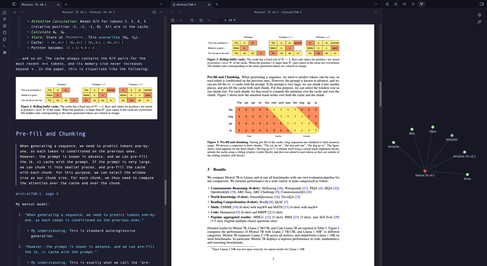

This is my obsidian vault for piling up notes on ml papers I read & building my mental model. My current aim is to complete reading 100 papers this year. Only 1 way to find out whether I can do it or not.

---

## Reading these notes

The best way to read these notes is to open them in Obsidian. You can see a preview of how a typical note looks like below:



I don't use a lot of plugins, so it's just a matter of opening the files in Obsidian. I switch between the Tokyo Night and the Catppuccin themes, and I sometimes use the excalidraw plugin to make diagrams. I also use the very convenient automatic table of contents plugin. And that's pretty much it.

### To get started

1. Make sure you have [Obsidian](https://obsidian.md/) installed and enabled the community plugins.

2. Clone this repo:

```bash
git clone https://github.com/sumitdotml/ml-papers-vault.git
```

3. Open the files in Obsidian.

That's it!

---

## Papers

1. [Mistral 7B v0.1](./Mistral%207B%20v0.1/Mistral%207b%20v0.1.md)