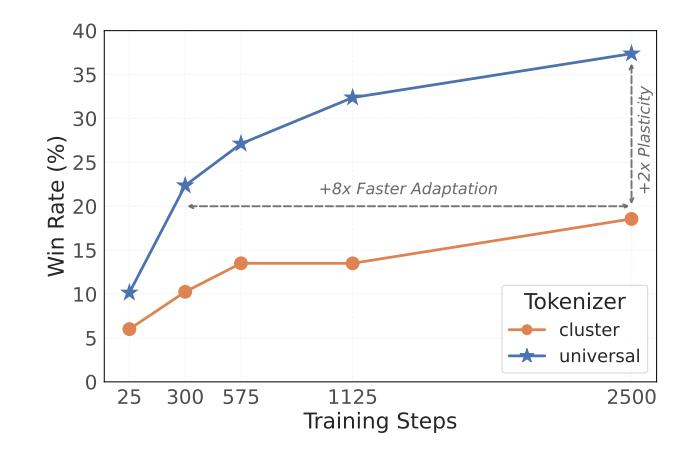
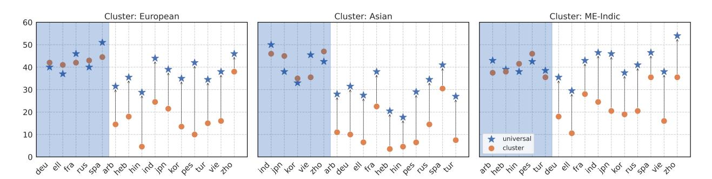
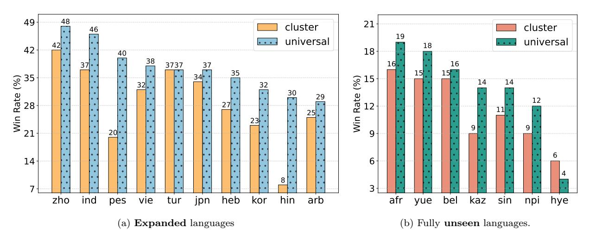
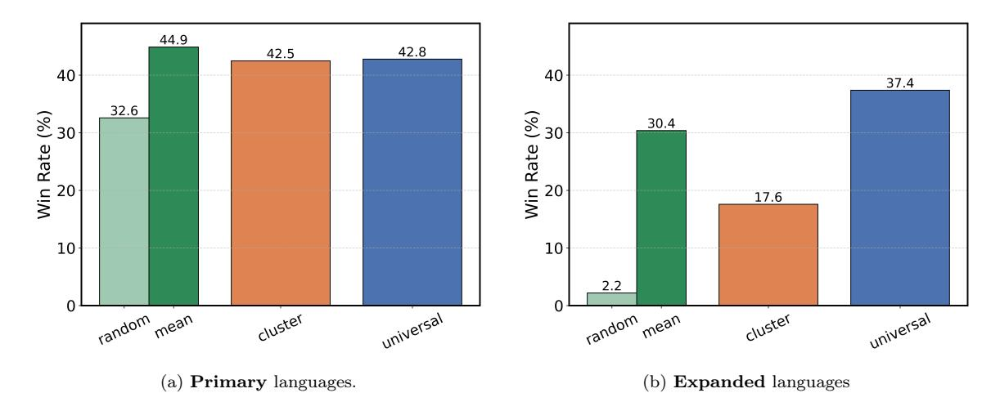
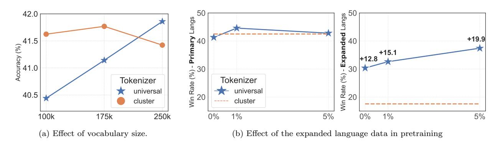
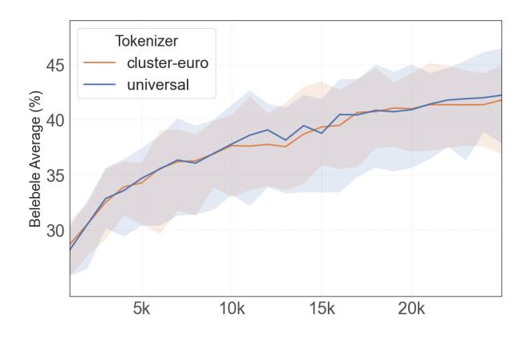
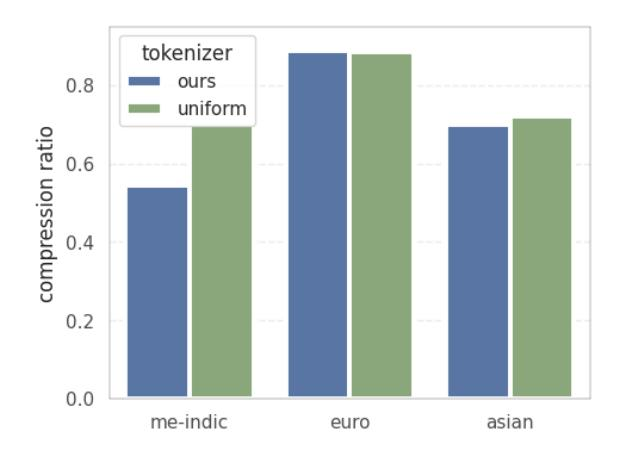
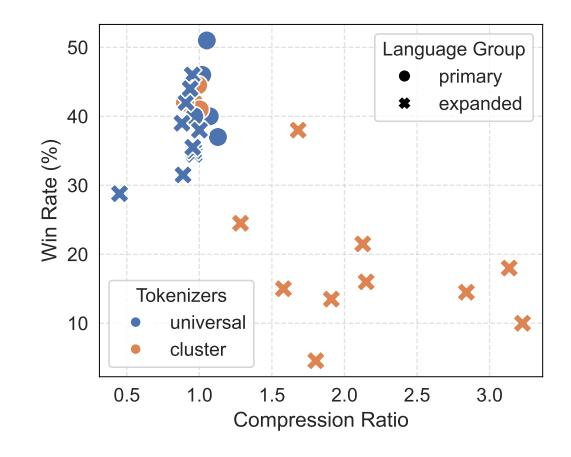

# One Tokenizer To Rule Them All: Emergent Language Plasticity via Multilingual Tokenizers

Diana Abagyan ⋆ 1 , Alejandro R. Salamanca 1 , Andres Felipe Cruz-Salinas 2 , Kris Cao 2 , Hangyu Lin 2 , Acyr Locatelli 2 , Marzieh Fadaee 1 , Ahmet Üstün ♦ 1 , and Sara Hooker ♦ 1

1Cohere Labs, 2Cohere

Corresponding authors: {<dianaabagyan> , <ahmet> , <sarahooker> }<@cohere.com>

# Abstract

Pretraining massively multilingual Large Language Models (LLMs) for many languages at once is challenging due to limited model capacity, scarce high-quality data, and compute constraints. Moreover, the lack of language coverage of the tokenizer makes it harder to address the gap for new languages purely at the post-training stage. In this work, we study what relatively cheap interventions early on in training improve "language plasticity", or adaptation capabilities of the model post-training to new languages. We focus on tokenizer design and propose using a universal tokenizer that is trained for more languages than the primary pretraining languages to enable efficient adaptation in expanding language coverage after pretraining. Our systematic experiments across diverse groups of languages and different training strategies show that a universal tokenizer enables significantly higher language adaptation, with up to 20.2% increase in win rates compared to tokenizers specific to pretraining languages. Furthermore, a universal tokenizer also leads to better plasticity towards languages that are completely unseen in the tokenizer and pretraining, by up to 5% win rate gain. We achieve this adaptation to an expanded set of languages with minimal compromise in performance on the majority of languages included in pretraining.

#### 1 Introduction

There are only a handful of research labs with enough compute resources and expertise to train large AI systems at scale [\[Maslej et al.](#page-22-0) , [2025](#page-22-0) ; [Hooker](#page-20-0) , [2024\]](#page-20-0). Most researchers and practitioners are forced to choose among available pretrained models for downstream tasks, even if they are not tailored to their use cases. Nowhere is this tension more evident than in the multilingual setting [\[Joshi et al.,](#page-20-1) [2020;](#page-20-1) [Singh et al.,](#page-24-0) [2024;](#page-24-0) [Üstün et al.,](#page-29-0) [2024\]](#page-29-0), where limited investment in multilingual support in pretraining often results in significant gaps in language coverage in state-of-the-art LLMs [\[Holtermann et al.,](#page-20-2) [2024\]](#page-20-2).

⋆First author. ♦Principal senior advisors.

Figure 1: UNIVERSAL tokenizer exhibits  $+2x$  higher plasticity with  $+8x$  faster adaptation compared to the cluster-specific baseline tokenizer. Average win rates on the expanded (new) language subset during continued pretraining that involves both primary and expanded language subsets  $(\S 2.1)$ .

This imbalance in language coverage has created a growing divide in the cost of use for particular language users as marginalized languages require more tokens and incur higher latency for generations [Ji et al., 2023; Cui et al., 2024; Ahia et al., 2023], restricting speakers of low-performing languages to lower quality technology [Held et al., 2023; Durmus et al., 2024; Nicholas & Bhatia,  $2023$ ; Ojo et al.,  $2025$ ]. Further compounding these issues, once a model is pretrained, it is hard to steer towards new behavior using post-training alone [Wang et al., 2025]. Unless the tokenizer has been calibrated to a new language during training, it often requires far more significant amount of data and intricate optimization steps [Muller et al., 2021].

**Multilingual plasticity** represents the capability of the language model to quickly adapt to lingual distribution shifts to the downstream target, which in our case, involves a new set of focus languages [Chen et al., 2023]. Given that pretraining requires the bulk of compute and cost resources, any intervention made at this stage that improves the *plasticity* for downstream developers and researchers is beneficial.

In this work, we investigate minimal and efficient pretraining interventions to reduce later adaptation costs. In particular, we identify tokenization as an area with relatively low cost of intervention, but potential for large downstream gains. We ask: Can we leverage tokenizers with broad language coverage to improve the plasticity of LLMs without hurting pretraining performance?

We hypothesize that a universal tokenizer that is trained on more languages than the primary pretraining languages, introduced from the start of pretraining, enables quick and effective interventions for adapting a model to new languages. This significantly diverges from the previous work that focuses on techniques such as vocabulary extension [Wang et al.,  $2020$ ] or retraining the embedding layer [Artetxe et al., 2020] after pretraining. These techniques are more costly, needing more resources like training budget, with varying degrees of success across languages [Limisiewicz et al., 2023; Sharthak et al., 2025; Nag et al., 2025].

We systematically investigate the impact of multilingual tokenizers through an exhaustive set of ablations at pretraining scale, which requires a significant investment of resources. We vary tokenizer, language subsets and adaptation strategy across 69 languages, and we find the following results:

1. The **UNIVERSAL** tokenizer significantly improves adaptation to new (expanded) languages, achieving an average of  $19\%$  higher win rate in continued pretraining experiments, compared

Figure 2: Win rates for models trained with the UNIVERSAL and CLUSTER tokenizers against Dolly generations [Singh et al., 2024]. The shaded blue portion represents a subset of primary languages, and the white represents expanded languages. On average, UNIVERSAL tokenizer achieves an increase of 18.9% win rate on expanded subset languages, and  $+0.3\%$  on primary languages compared to the Cluster tokenizers across clusters.

to the baseline tokenizers specialized to pretraining languages. In addition to achieving higher adaptation, the **UNIVERSAL** tokenizer exhibits almost the same performance on primary languages with no more than  $2\%$  difference in downstream evaluation against the baseline tokenizer.

- 2. For targeted adaptation where the new languages are the only focus, the **UNIVERSAL** tokenizer achieves an average of  $14.6\%$  improvement over the baseline tokenizer for the expanded languages subset. Furthermore, for adapting to fully **unseen** languages, not included both in the tokenizer and pretraining (the most extreme case of adaptation), UNIVERSAL tokenizer outperforms the baseline by up to  $5\%$  gain in win rates across 7 heavily under-resourced languages.
- 3. We find that the UNIVERSAL tokenizer enables more than 8x faster adaptation performance, requiring much less additional training, and therefore minimal costs. We believe that this dramatically benefits practitioners who want to extend the language coverage of a pretraining model with minimal intervention.

# Methodology and Experimental Setup 2

## 2.1 Methodology and Core Ablations

Language Coverage and Model Variants. Our experiments include 62 typologically and lexicographically diverse languages, broken up into three geographically motivated clusters: (1) European languages, (2) Asian languages, and (3) Middle-Eastern and Indic languages (referred to as ME-Indic throughout the paper). For each geo-cluster, we pretrain language models primarily on the languages within that cluster (referred to as **primary** subset) and we use the remaining languages (referred to as **expanded** subset) as reference points for plasticity adaptation experiments. For example, for the European cluster, the primary subset consists of languages such as Spanish, Russian, and Portuguese, and the expanded subset includes the 10 languages outside of the dominant training data for that cluster. In addition, we also consider 7 fully unseen languages, such as Sinhala and Kazakh, which were not present in the tokenizer or base model training data. The full language list with clusters is provided in Appendix  $E$ .

**Adaptation Strategies.** One of our goals is to introduce highly plastic and adaptable model properties. A practitioner may choose to conduct language adaptation using a variety of different training strategies, influenced by what data they may have available. Ideally, the choices we make for the tokenizer allow for improved plasticity given any approach taken after pretraining. Hence, we evaluate our interventions under various different adaptation strategies, which include continued pretraining with data in both primary and expanded language subsets, targeted adaptation for expanded languages, and targeted adaptation for fully unseen languages. We briefly describe both these strategies and experimental details below:

- Continued pretraining with data from primary and expanded languages: The objective for this strategy is to increase language coverage of the model, so that it supports both primary and expanded languages. Half of the training mix consists of an even distribution of all languages in the instruction finetuning data, and the other half is a standard cooldown mix with high-quality datasets (See § [2.2\)](#page-3-0). This imparts instruction-following abilities to our base models, and also allows for evaluation on both the primary and expanded languages.
- Targeted adaptation (expanded languages): In these experiments, we explore a targeted language adaptation through supervised fine-tuning. The post-training data solely consists of instruction-style data in the expanded language subsets for each cluster model. This allows us to isolate the effect of introducing new languages that are not focused on during pretraining but represented in the tokenizer.
- Targeted adaptation (fully unseen languages): In the final set of experiments, we explore the most extreme setting of targeted adaptation to fully unseen languages that are not seen in the tokenizer or pretraining. In this setting, we consider the availability of the data in one language only for each experiment, thus, we fine-tune the base model on one language at a time. This ablation enables evaluating our approach for adaptation under a heavily under-resourced scenario.

Tokenizer Variants. We train a massively multilingual tokenizer using data from all 62 languages as well as cluster-specific tokenizers that represent only the primary language subsets. Throughout the paper, we refer to these tokenizers as Universal and Cluster tokenizers, respectively. We include more details about the tokenizer training in Section [2.3.](#page-4-0)

#### 2.2 Experimental Set-up

Pretraining datasets. Models are pretrained with a mixture of English, code, and multilingual corpora, where data weights are distributed as 55%, 15%, and 30%, respectively. Upweighting English in multilingual training is a common practice, due to higher task coverage and quality, which is crucial for cross-lingual transfer [\[Dash et al.,](#page-18-1) [2025;](#page-18-1) [Singh et al.,](#page-24-0) [2024;](#page-24-0) [Ravisankar et al.,](#page-23-0) [2025\]](#page-23-0). We also include code data as it has become a standard part of the training recipe even for natural language models, and has been found to boost performance on other tasks when included in pre-training [\[MA et al.;](#page-22-5) [Aryabumi et al.,](#page-16-1) [2024\]](#page-16-1). We use a large corpus of data from a variety of public and proprietary sources. For models we pretrain with the Universal tokenizer, we reallocate 5% of the training mixture from English data and uniformly distribute it among all the expanded languages, to avoid undertrained tokens in the vocabulary [\[Land & Bartolo,](#page-21-1) [2024\]](#page-21-1). However, in Section [5.4,](#page-12-0) we ablate this percentage and show that even when no expanded language subset data is included in pretraining, the Universal tokenizer significantly improves multilingual plasticity.

Cooldown and instruct datasets. For continued pretraining, we use cooldown data that involves upweighting higher quality datasets, comprised of text, math, code, and instruct-style data [\[Aryabumi et al.,](#page-16-1) [2024\]](#page-16-1). It has been found by recent work to improve performance on downstream tasks, in particular by helping impart instruction-following capabilities [\[Parmar et al.,](#page-23-1) [2024;](#page-23-1) [Team](#page-24-2) [et al.,](#page-24-2) [2025\]](#page-24-2). We include a high-quality mix of proprietary and open data, much of which was created by following a multilingual data arbitrage strategy [\[Odumakinde et al.,](#page-22-6) [2024\]](#page-22-6), covering 100,000 prompt-completion pairs in 23 languages. Finally, for experiments on fully unseen languages, we emulate a realistic data-constrained regime, and use only 14,800 instructions per language from the translated Dolly training set from Aya Collection [\[Singh et al.,](#page-24-0) [2024\]](#page-24-0).

Training details. For our experiments, as standard for most LLMs, we use the Transformer-based decoder-only architecture [\[Vaswani et al.,](#page-29-2) [2017;](#page-29-2) [Radford & Narasimhan,](#page-23-2) [2018\]](#page-23-2). Our architecture includes key optimizations such as Parallel Attention Blocks [\[Chowdhery et al.,](#page-17-1) [2023\]](#page-17-1), Grouped Query Attention [\[Ainslie et al.,](#page-15-1) [2023\]](#page-15-1), SwiGLU activation function [\[Shazeer,](#page-24-3) [2020\]](#page-24-3), and Rotary Positional Embeddings [\[Su et al.,](#page-24-4) [2024\]](#page-24-4).

Our ablations are extensive and require a large amount of pretraining runs. Given the huge amount of compute required for pretraining, where training a 3.3B parameter model on 128 Nvidia H100 GPUs takes 11 hours, we focus on only 3.3 billion parameter language models for ablations. We train each base variant for 100 billion tokens using a total of 25,000 steps. Given the number of experiments we run, and the variety of factors we evaluate, this model size and amount of training steps is at the edge of what is computationally feasible at pretraining scale. Overall, the goal is not to emulate the settings of a full pretraining run, but to get sufficient signal about the relative merits of different approaches. In the continued pretraining strategy, we train for an additional 10.5B tokens and the targeted adaptation are done for 4 epochs over the respective datasets for each experiment. Additional training and infrastructure details are provided in Appendix [B.](#page-32-0)

Infrastructure. We use Nvidia H100 GPUs for training and evaluation. We use FAX [\[Yoo et al.,](#page-30-1) [2022\]](#page-30-1), which is a high-performance training framework built on JAX [\[Bradbury et al.,](#page-16-2) [2018\]](#page-16-2), enabling efficient tensor and model parallelism.

#### 2.3 Tokenizer Training

All tokenizers are trained using the Byte Pair Encoding algorithm [\[Sennrich et al.,](#page-23-3) [2016\]](#page-23-3). Additional implementation details about the tokenizer training is given in Appendix [A.](#page-32-1)

Language weighting. In addition to varying the coverage of the tokenizer, with some being trained on Universal and Cluster language coverage, we also invest in a methodology that adjusts the weighting based upon availability of data. In contrast to traditional approaches which sample uniformly across all data and end up dominated by most frequent languages, we consider two factors: (1) natural distribution of the data available across languages, and (2) language buckets formed by languages that share the same family and script (which are more likely to share tokens). Within each language bucket, we use uniform weighting across languages. Concretely, for a language i, where w d i and w b i denote weights for data distribution and language bucket, respectively, we compute the language weights in the tokenizer data mixture as follows:

$$w_i = \frac{w_i^d \cdot w_i^b}{\sum_n w_n^d \cdot w_n^b} \tag{1}$$

This way, we balance natural data distribution (skewed through the high-resource languages) with language bucketing in a principled manner, ensuring that there is equitable representation for diverse scripts and lower-resourced languages. Our pretraining experiments (Section [3,](#page-5-0) Appendix [D\)](#page-33-0) show that our specialized weighting combining language bucketing with size-proportional data distribution enables better compression ratios than uniform weighting and achieves better downstream performance. For the remainder of this work, we use specialized weighting throughout experiments, unless specified otherwise.

Vocabulary size. We use a vocabulary size of 250k tokens in our main experiments. However, in § [5.3,](#page-11-0) we explore how vocabulary size impacts performance for both Universal and Cluster tokenizers, and vary the vocabulary size between 100k, 175k, and 250k to understand the impact.

## 2.4 Evaluation

Open-ended evaluation. [Goldman et al.](#page-19-1) [\[2024\]](#page-19-1) find that generative tasks are more informative than classification in evaluating tokenizers, likely due to the number of generation steps. Following [Üstün et al.](#page-29-0) [\[2024\]](#page-29-0), the quality of generations is assessed using LLM-as-a-Judge win rates, where original generations are used as the reference answer. We use the dolly\_human\_edited and the dolly\_machine\_translated splits of the Aya Evaluation Dataset [\[Singh et al.,](#page-24-0) [2024\]](#page-24-0) as test data for this task, which are formed by translating 200 held-out examples from the Dolly-15k [\[Conover](#page-18-2) [et al.,](#page-18-2) [2023\]](#page-18-2). We use 15 adaptation languages for open-ended evaluation, listed in Appendix [E.](#page-35-0)

Prior work has shown that LLMs as evaluators are reasonable proxies and aligned with human preferences also in multilingual settings [\[Üstün et al.,](#page-29-0) [2024;](#page-29-0) [Singh et al.,](#page-24-5) [2025;](#page-24-5) [Dang et al.,](#page-18-3) [2024;](#page-18-3) [Kreutzer et al.,](#page-21-2) [2025\]](#page-21-2). We use Command-A [\[Cohere et al.,](#page-17-2) [2025\]](#page-17-2) as the judge model, given its reported strength as the best open-weights judge on multilingual setting, scoring closely to GPT4o [\[Gureja et al.,](#page-20-5) [2024;](#page-20-5) [Pombal et al.,](#page-23-4) [2025\]](#page-23-4). The full judge prompt is included in Appendix [C.3.](#page-33-1)

Task-specific performance. We use two task specific evaluations for multilingual evaluations. Belebele [\[Bandarkar et al.,](#page-16-3) [2024\]](#page-16-3) is a multiple-choice question machine-reading comprehension (MRC) dataset representing 122 language variants. Multilingual MMLU (M-MMLU) [\[Dac Lai](#page-18-4) [et al.,](#page-18-4) [2023\]](#page-18-4) is a machine-translated version of the original MMLU dataset [\[Hendrycks et al.,](#page-20-6) [2021\]](#page-20-6) that contains questions ranging in topic from STEM to humanities.

English-only evaluation. Additionally, we also evaluate models on 11 English-only natural language inference and commonsense reasoning benchmarks: ARC-C and ARC-E [\[Chollet,](#page-17-3) [2019\]](#page-17-3), BoolQ [\[Clark et al.,](#page-17-4) [2019\]](#page-17-4), CommonsenseQA [\[Talmor et al.,](#page-24-6) [2019\]](#page-24-6), Hellaswag [\[Zellers et al.,](#page-30-2) [2019\]](#page-30-2), MMLU [\[Hendrycks et al.,](#page-20-6) [2021\]](#page-20-6), OpenBookQA [\[Mihaylov et al.,](#page-22-7) [2018\]](#page-22-7), PIQA [\[Bisk et al.,](#page-16-4) [2020\]](#page-16-4), SIQA [\[Sap et al.,](#page-23-5) [2019\]](#page-23-5), TruthfulQA [\[Lin et al.,](#page-21-3) [2022\]](#page-21-3), and WinoGrande [\[Sakaguchi et al.,](#page-23-6) [2019\]](#page-23-6).

We include task-specific evaluations (both multilingual and English-only) to understand the relative merit of different design choices. Typically pretrained models do not perform well at downstream tasks at this point in training, as the models have not yet been optimized for instruction following [\[Wang et al.,](#page-30-3) [2022;](#page-30-3) [Üstün et al.,](#page-29-0) [2024;](#page-29-0) [Aakanksha et al.,](#page-15-2) [2024\]](#page-15-2), or aligned using reinforcement learning [\[Ahmadian et al.,](#page-15-3) [2024;](#page-15-3) [Dang et al.,](#page-18-3) [2024\]](#page-18-3). Hence, we do not expect state-of-the-art performance, but rather evaluate the relative signal of different variants.

| Cluster                  | Tokenizer | Belebele | M-MMLU | EN Tasks |
|--------------------------|-----------|----------|--------|----------|
| <b>PRIMARY LANGUAGES</b> |           |          |        |          |
| European                 | CLUSTER   | 41.4     | 31.1   | 48.5     |
|                          | UNIVERSAL | 41.9     | 30.9   | 48.4     |
| Asian                    | CLUSTER   | 38.2     | 29.6   | 48.2     |
|                          | UNIVERSAL | 38.1     | 28.9   | 48.1     |
| Middle East & Indic   | CLUSTER   | 38.1     | 29.2   | 49.1     |
|                          | UNIVERSAL | 36.5     | 28.6   | 48.2     |

Table 1: Comparison of Cluster vs. UNIVERSAL tokenizers during the **pretraining** on the primary languages across three regional clusters. Performance with UNIVERSAL tokenizer is comparable to CLUSTER tokenizers across all the geo-cluster models.

|           | bul            | cat            | ces            | dan            | deu            | ell            | est            | eus            | fin            | fra            | hrv            | hun            | ita            | lit            |
|-----------|----------------|----------------|----------------|----------------|----------------|----------------|----------------|----------------|----------------|----------------|----------------|----------------|----------------|----------------|
| UNIFORM   | 41.0           | 43.7           | 42.7           | 41.5           | 43.6           | 41.2           | 35.7           | 38.4           | 34.6           | 45.0           | 42.1           | 36.6           | 40.6           | 41.0           |
| UNIVERSAL | 42.1 (+1.1) | 46.5 (+2.8) | 45.5 (+2.8) | 41.1 (-0.4) | 44.3 (+0.7) | 42.7 (+1.5) | 37.9 (+2.2) | 40.6 (+2.2) | 32.4 (-2.2) | 45.3 (+0.3) | 42.6 (+0.5) | 37.9 (+1.3) | 40.1 (-0.5) | 43.1 (+2.1) |
|           | lvs            | nld            | nob            | pol            | por            | ron            | rus            | slk            | slv            | spa            | srp            | swe            | ukr            | Average        |
| UNIFORM   | 42.3           | 42.7           | 42.3           | 38.4           | 41.0           | 40.8           | 41.0           | 42.4           | 39.5           | 42.5           | 42.4           | 42.9           | 40.9           | 41.0           |
| UNIVERSAL | 40.5 (-1.8) | 42.7 (+0.0) | 42.8 (+0.5) | 39.8 (+1.4) | 43.8 (+2.8) | 41.2 (+0.4) | 41.4 (+0.4) | 43.5 (+1.1) | 41.8 (+2.3) | 43.8 (+1.3) | 43.4 (+1.0) | 43.4 (+0.5) | 40.0 (-0.9) | 41.9 (+0.9) |

Table 2: Comparison of UNIVERSAL vs. UNIFORM tokenizer performance on Belebele, when used for pretraining of Euro cluster model. In tokenizer training, we use all the languages (67 languages; primary and expanded subsets) and only vary the language weighting. UNIVERSAL tokenizer with balanced weighting using language buckets outperforms UNIFORM weighting in 21 European languages out of 27, with a relative gain of  $2.2\%$  (41.9 vs  $41.0$ ) on average.

# Results on Pretraining Performance 3

#### Section Findings

- Pretraining with UNIVERSAL tokenizer produces well-rounded models with competitive results on a variety of tasks for the primary languages, differing from the CLUSTER tokenizer models by no more than  $0.5\%$  average accuracy across tasks and clusters.
- Our specialized tokenizer weighting that uses language buckets to balance the data availability, leads to better pretraining performance up to 2.8 accuracy increase as measured in the Euro cluster model.

In this section, we first benchmark the performance of our pretrained models, to ensure that using a UNIVERSAL tokenizer doesn't cause degradations in performance, as may be expected when using a tokenizer optimized for a broader set of languages than the primary set.

UNIVERSAL tokenizer does not compromise performance on primary languages. As seen in Table 1, we find that our expanded UNIVERSAL tokenizer is remarkably competitive against CLUSTER across the geo-cluster models. The difference in pretraining performance is less than at most  $1\%$  average accuracy in English tasks. The highest performance difference between UNIVERSAL and CLUSTER tokenizers for multilingual tasks is only  $1.6\%$  average accuracy on Belebele for ME-Indic cluster  $(38.1\% \text{ vs } 36.5\%)$ . Overall, we observe minimal trade-offs in performance on primary cluster languages switching to UNIVERSAL tokenizer.

| Cluster                | Tokenizer | Dolly Win Rates (%) |              |
|------------------------|-----------|---------------------|--------------|
|                        |           | PRIMARY             | EXPANDED     |
| European               | CLUSTER   | 42.8                | 17.6         |
|                        | UNIVERSAL | 42.8                | 37.4 (+19.9) |
| Asian                  | CLUSTER   | 41.7                | 11.7         |
|                        | UNIVERSAL | 41.8                | 29.5 (+17.8) |
| Middle East & Indic | CLUSTER   | 39.7                | 22.8         |
|                        | UNIVERSAL | 40.2                | 41.8 (+18.9) |

Table 3: Win rates after continued pretraining on primary and expanded language subsets. The Universal tokenizer matches Cluster performance on primary languages and shows large gains (up to 19.9%) on average of expanded language subsets across all clusters.

|                     | CLUSTER | UNIVERSAL    |
|---------------------|---------|--------------|
| European            | 27.2    | 37.4 (+10.2) |
| Asian               | 18.8    | 34.3 (+15.7) |
| Middle East & Indic | 23.31   | 41.1 (+17.8) |

Table 4: Win rates on expanded languages after targeted adaptation. The Universal tokenizer shows better performance (up to 17.8%) across all clusters over the baseline Cluster tokenizer.

In fact, we observe that the Universal tokenizer leads to a slight increase on average on Belebele for Euro cluster (41.9 vs 41.4) and achieves much closer performance for Asian cluster (38.1 vs 38.2). As additional validation, Figure [6](#page-32-2) in Appendix [C.1](#page-32-3) shows the progression of average Belebele performance for both tokenizers for Euro cluster models during pretraining. The Universal tokenizer achieves approximately similar performance throughout the whole pretraining, also suggesting the same trend in a longer pretraining run. Overall, these results showcase that using a Universal tokenizer doesn't spell any significant performance degradation in pretraining for the primary languages.

Balanced language weighting with language buckets for tokenizer training leads to better pretraining performance. As described in Section [2.3](#page-4-0) on tokenizer training, we weight the languages using buckets formed by script and language family, balanced against data availability. In order to motivate this weighting scheme, we compare pretraining performance of Universal tokenizer against a baseline tokenizer (Uniform), where all languages are uniformly weighted except English.[1](#page-7-0) We conduct this ablation in the Euro cluster, where the number of primary languages is the highest. In tokenizer training, we use all the languages (62 languages; primary and expanded subsets) and only vary the language weighting. As shown in Table [2,](#page-6-1) Universal tokenizer with balanced weighting using language buckets outperforms Uniform weighting in 21 European languages out of 27, with a relative gain of 2.2% (41.9 vs 41.0) on average. Further validating pretraining results, we provide the comparison for compression performance between these two tokenizers in Appendix [D,](#page-33-0) where the results show better overall compression in Universal tokenizer.

1For both tokenizers' weighting, we use a fixed proportion of 30% for English due to much larger data volume and much higher diversity in available data. This also ensures a fair comparison between tokenizer weighting.

# 4 Results on Enhanced Multilingual Plasticity

## 4.1 Benefits of Plasticity in Continued Pretraining

#### Section Findings

- The Universal tokenizer leads to significantly higher plasticity over the Cluster specific tokenizers in continued pretraining (on primary & expanded languages) with an average increase in win rate of 18.9% for the expanded language subsets across clusters.
- The Universal tokenizer enables adaptation boost with no drop in primary languages compared to Cluster tokenizer, with a near identical performance (with a slight increase of 0.3% on average) on downstream open-ended generations.

In this section, we ask: Does varying the approach for the tokenizer lead to plasticity benefits after continued pretraining on both primary and expanded languages?

Models trained with the Universal tokenizer demonstrate significantly higher win rates on the expanded subset. Figure [2](#page-2-1) and Table [3](#page-7-1) show results of evaluation across the Euro, Asian, and ME-Indic clusters, with 5 languages belonging to each primary language subset and 10 in the expanded subset belonging to the other two clusters. We see that the Universal tokenizer achieves an average gain of 18.9% in win rates across all three geo-cluster models on the expanded subsets, compared to models trained with the Cluster tokenizer. Improvement is consistent across clusters, where we find +19.9%, +17.8%, and +18.9% increase in win rate for Euro, Asian, and ME-Indic cluster models, respectively. Among all the expanded languages, Persian (+25.8%), Hindi (+23.3%), and Vietnamese (+22.0%) show the highest benefit from the Universal tokenizer in the Euro, Asian, and ME-Indic clusters, respectively.

Universal tokenizer preserves performance on multiple clusters. While the Universal tokenizer provides significant gains on the expanded languages, in Figure [2,](#page-2-1) we observe that the performance on primary languages is nearly the same across both tokenizers in all three clusters. There is only a 0.3% win rate difference across all clusters for primary languages when comparing tokenizers, where Universal tokenizer even leads to a slight increase over the Cluster tokenizer in the European, Asian, and ME-Indic models by 0.3%, 0.1%, and 0.5%, respectively. This is beneficial, as it suggests no trade-offs of improving plasticity for an expanded set of languages by using the Universal tokenizer for the primary languages a provider is interested in when developing a model.

# 4.2 Benefits of Plasticity in Targeted Adaptation

#### Section Findings

- For the targeted language adaptation through SFT, where only the expanded language data is introduced, the Universal tokenizer is much more performant than the Cluster tokenizer with 14.6% average increase across languages and geo-clusters.
- Universal tokenizer enables multilingual plasticity not only for languages seen during tokenizer training but also for fully unseen languages with an average improvement of 2% on 7 under-resourced languages over the Cluster tokenizer.

Figure 3: Language-specific results after targeted adaptation through SFT for the Euro cluster model to **expanded** languages (a) and fully **unseen** languages (b). UNIVERSAL tokenizer outperforms the CLUSTER tokenizer in both language subsets, where the relative gains over the cluster-specific tokenizer go up to  $22\%$  on expanded languages (Hindi), and  $5\%$  on unseen languages (Kazakh).

An experimental setting of great interest is the more realistic scenario where a downstream developer only has access to data in the EXPANDED languages. To mimic this scenario, we evaluate the impact of our interventions when only supervised fine-tuning only on the expanded language subset is feasible.

UNIVERSAL tokenizer outperforms CLUSTER tokenizers by high margins in targeted adaptation for expanded language set. Table 4 shows average win rates of UNIVERSAL and CLUSTER tokenizers for each geo-cluster. UNIVERSAL tokenizer achieves  $10.2\%$ ,  $15.7\%$ , and  $17.8\%$ relative win rate gains over the CLUSTER-specific tokenizers for Euro, Asian, and ME-Indic clusters, respectively. In Figure 3a, we also plot individual language gains for the Euro cluster. UNIVERSAL consistently enables higher plasticity than CLUSTER tokenizer where the relative gains go up to  $22.0\%$  and  $20.0\%$  in Hindi and Farsi, respectively.

UNIVERSAL tokenizer also provides large gains in targeted adaptation for fully unseen **language set.** In the most extreme setting, we evaluate the benefits of our tokenizer intervention for adaptation to languages that are **fully unseen** in both tokenizer and pretraining. Figure 3b shows results on supervised fine-tuning experiments on 7 unseen languages.2 It is critical that all these languages are extremely under-resourced, and this adaptation is performed in a low-data environment, as this is representative of the constraints faced by developers in these languages.

In the most extreme setting, UNIVERSAL tokenizer enables unseen language gains. We find that UNIVERSAL tokenizer enables improvements over the CLUSTER tokenizer on the unseen languages with an average gain of  $2.0\%$  in win rates, where it goes up to  $5.0\%$  in Nepali. Given that the downstream performance is generally lower for these languages due to their absence in the tokenizer and pretraining, and also constraints on available data (only 15k per language), we find this to be a promising direction of future research and another reason to invest in more flexible tokenizer design.

&lt;sup>2Afrikaans, Kazakh, Belarusian, Cantonese, Nepali, Armenian, Sinhala

Figure 4: Win rates after continued pretraining, comparing Cross-lingual Vocabulary Adaptation (CVA) through tokenizer replacement. After the pretraining, the CLUSTER tokenizer is replaced with the UNIVER-SAL tokenizer, the embeddings for the shared tokens are preserved and the new tokens are either randomly initialized (random) or by the average of shared embeddings (mean). The UNIVERSAL tokenizer significantly outcompetes both CVA approaches on expanded languages.

#### Key Discussions 5

#### 5.1 Comparison with cross-lingual vocabulary adaptation

#### Section Findings

- UNIVERSAL tokenizer outperforms cross-lingual vocabulary adaptation (CVA) by  $7\%$  in the expanded languages where the vocabulary is replaced (before the continued pretraining), and the new tokens are initialized by average embeddings of the shared tokens.
- CVA through tokenizer replacement fails to achieve competitive performance even with the CLUSTER tokenizer when the new tokens are initialized randomly. CVA (random) only reaches  $2.2\%$  win rate in the expanded languages and falls behind the UNIVERSAL tokenizer by  $35.2\%$  relative drop in win rate.

Cross-lingual vocabulary adaptation (CVA) [Yamaguchi et al., 2024b] aims to adapt the existing tokenizer and hence the token embeddings to the new languages through expansion or replacement after pretraining, and is a common approach for language adaptation. A more detailed overview of CVA can be found in Section 6.2. In this ablation, we ask: how does the UNIVERSAL tokenizer compare with CVA for adapting new languages?

To have a fully comparable setup with our body of experiments, we took the pretrained Euro cluster model that is trained with the CLUSTER tokenizer and replaced the tokenizer with the UNIVERSAL tokenizer. Token embeddings that are shared between CLUSTER and UNIVERSAL tokenizers are preserved, and new tokens are either randomly initialized by sampling from a normal distribution (random), or with the average of the shared embeddings (mean). After vocabulary replacement and token initialization, we follow the same continued pretraining described in Section  $2.1$ .

The results for this ablation are given in Figure 4. We find that when randomly initializing the new tokens, CVA (tokenizer replacement) fails to achieve comparable performance even against the CLUSTER tokenizer, and significantly lags behind the UNIVERSAL tokenizer by  $15.4\%$  and  $35.2\%$  win

Figure 5: (a) UNIVERSAL tokenizer requires a larger vocabulary size to achieve the same (or better) pretraining performance with the Cluster tokenizers on **primary** languages, as evaluated in Belebele. (b) UNIVERSAL tokenizer exhibits significantly higher adaptation gains over the CLUSTER tokenizer even when there is no data from the expanded languages added in pretraining.

rates for primary and expanded languages respectively. Notably, initializing the new tokens with the mean of the shared vocabulary (mean in Figure 4), outperforms random initialization. While tokenizer replacement (mean) is an improvement over the unadapted CLUSTER tokenizer by  $12.8\%$ relative increase in win rates for expanded languages, our UNIVERSAL tokenizer leads to better adaptation performance by  $7\%$  difference in average win rate (37.4% vs 30.4%). Interestingly, CVA (mean) achieves slightly higher performance in the primary languages by  $2.1\%$  average win rate. Overall, these results show that it is more effective to use a UNIVERSAL tokenizer from the start, rather than substituting it in after pretraining.

#### 5.2 Adaptation Efficiency with the Universal Tokenizer

#### Section Findings

• UNIVERSAL tokenizer enables  $+8x$  faster adaptation in terms of sample efficiency and  $+2x$ higher performance for downstream adaptation compared to CLUSTER tokenizer.

In this ablation, we evaluate how much faster adaptation takes place with the UNIVERSAL tokenizer. Faster adaptation means much fewer resources necessary, namely cost, which is of great interest to practitioners who want to adapt an LLM to expanded language coverage.

To evaluate the adaptation speed, in comparison to CLUSTER tokenizer, we evaluated the intermediate checkpoints on the expanded languages during continued pretraining for Euro cluster models. Figure 1 shows average win rates on 10 expanded languages. As seen in the plot, in only  $300 \text{ steps}$ UNIVERSAL tokenizer reaches the level of performance that CLUSTER achieves at 2500 steps, showing  $+8x$  faster adaptation. Given that 300 steps correspond to nearly 150K samples (compared to 1.3M at 2500 steps), UNIVERSAL tokenizer requires also much less data to achieve the same performance with the end performance of the baseline, confirming the effectiveness of our proposal.

# 5.3 Necessity of Large Vocabulary Size

#### Section Findings

• The Universal tokenizer demonstrates effectiveness without compromising pretraining performance for primary languages, but it necessitates a large vocabulary size, such as 250,000 subwords, to achieve optimal results.

In the previous sections, we establish greater performance in multilingual plasticity with the Universal compared to Cluster tokenizer. In this ablation, we ask: What is the required vocabulary size for the Universal tokenizer to avoid performance degradation on primary pretraining languages?

To determine the optimal vocabulary size, we run additional pretraining experiments where we vary the vocabulary size from 100,000 tokens to 250,000 tokens while adjusting the model parameters so that the total number of trainable parameters remains constant. We evaluate the performance for the primary pretraining languages on Belebele. Results are shown in Figure [5a.](#page-11-1) The models trained with Cluster tokenizers don't vary much in performance, and surpass the Universal tokenizer at small vocabulary sizes (100k and 175k). However, the Universal tokenizer scales performance with the vocabulary size, and overtakes the Cluster tokenizer at 250k vocabulary size. Our findings are consistent with previous work that shows the benefits of large vocabularies [\[Tao et al.,](#page-24-7) [2024;](#page-24-7) [Huang et al.,](#page-20-7) [2025\]](#page-20-7), and suggests investment in universal tokenizers require a reallocation of weights to ensure a proper vocabulary budget. Based on this ablation, we use the vocabulary size of 250k in our main pretraining runs.

## 5.4 Presence of Expanded Language Subset in Pretraining

#### Section Findings

• The Universal tokenizer achieves a performance boost of 12.8% over the Cluster tokenizer for the expanded languages even there is no pretraining data is used for these languages. However, including a minimal data up to 5% increases adaptation performance on the expanded languages from 12.8% to 19.8% win rates, without hurting performance in primary pretraining languages.

In the large and often noisy datasets used to train LLMs, there is often language contamination [\[Blevins & Zettlemoyer,](#page-16-5) [2022\]](#page-16-5). Therefore, it can be difficult to claim a language is truly "new". In our final ablation, to test the robustness of our claims of plasticity under different assumptions of multilingual data presence, we evaluate 0%, 1%, and 5% proportion of expanded languages in pretraining for the European cluster.

Figure [5b](#page-11-1) shows that even in the most conservative case of 0% multilingual percentage for the new languages (the expanded subset), the Universal tokenizer exhibits 12.8% gain in win rate as compared to the Cluster tokenizer. Notably, increasing this percentage up to 5% does not hurt performance in primary pretraining languages, but increases adaptation performance on the expanded languages from 12.8% to 19.8% win rates.

# 6 Related Work

#### 6.1 Multilingual Tokenizers

Tokenization remains a key challenge for multilingual models, particularly due to inefficiencies and disparities across scripts. [Petrov et al.](#page-23-7) [\[2023\]](#page-23-7) show that many standard or English-centric tokenizers disproportionately fragment non-Latin scripts, sometimes producing up to 15 times more tokens than for equivalent English content. These imbalances can lead to practical consequences such as increased API usage costs [\[Ahia et al.,](#page-15-0) [2023;](#page-15-0) [Petrov et al.,](#page-23-7) [2023\]](#page-23-7), longer inference times [\[Hof](#page-20-8)[mann et al.,](#page-20-8) [2022;](#page-20-8) [Sun et al.,](#page-24-8) [2023\]](#page-24-8), and reduced usable context window for non-English languages [\[Velayuthan & Sarveswaran,](#page-29-3) [2025;](#page-29-3) [Ahia et al.,](#page-15-0) [2023\]](#page-15-0), and degraded downstream task performance [\[Goldman et al.,](#page-19-1) [2024;](#page-19-1) [Gow-Smith et al.,](#page-20-9) [2022;](#page-20-9) [Fujii et al.,](#page-19-2) [2023\]](#page-19-2). Moreover, inefficient tokenization for non-English languages can inflate training costs by up to 68% [\[Ali et al.,](#page-15-4) [2024\]](#page-15-4).

To support multilinguality, the mT5 model introduced a 250k SentencePiece vocabulary with bytefallback, pretrained on 101 languages using temperature-based sampling to balance high- and lowresource languages [\[Xue et al.,](#page-30-5) [2021\]](#page-30-5). Additionally, recent work has explored tokenization approaches tailored to better reflect the structure of diverse writing systems. For example, Grapheme-aware tokenization, using Unicode grapheme clusters as atomic units via methods like Grapheme Pair Encoding (GPE) [\[Velayuthan & Sarveswaran,](#page-29-3) [2025\]](#page-29-3) or MYTE, a segmentation strategy motivated by morphemes [\[Limisiewicz et al.,](#page-21-4) [2024\]](#page-21-4), offers improved representation for complex scripts.

#### 6.2 Language Adaptation Post-Training

There are a number of ways that language adaption of pretrained language models (PLMs) is commonly approached. In terms of additional training, continued pretraining (CPT) and supervised fine-tuning (SFT) are the most common methods. Continued pretraining involves extended training on the adaptation language corpora [\[Han & Eisenstein,](#page-20-10) [2019;](#page-20-10) [Muller et al.,](#page-22-3) [2021\]](#page-22-3), but requires a significant amount of data, which may not be accessible for lower-resourced languages. Supervised fine-tuning is also a standard approach [\[Kumar et al.,](#page-21-5) [2022;](#page-21-5) [Adelani et al.,](#page-15-5) [2021;](#page-15-5) [Cahyawijaya et al.,](#page-16-6) [2021\]](#page-16-6), requiring less data than CPT, but possibly leading to catastrophic forgetting of capabilities from pretraining [\[Rolnick et al.,](#page-23-8) [2019;](#page-23-8) [Chaudhry et al.,](#page-17-5) [2019\]](#page-17-5). In particular, instruction fine-tuning is popular in order to impart instruction-following capabilities as well [\[Gala et al.,](#page-19-3) [2024\]](#page-19-3). Claims as to the advantages of one over the other are mixed- [Ebrahimi & Kann](#page-19-4) [\[2021\]](#page-19-4) find that in their setup, CPT is more effective than SFT, and [Yong et al.](#page-30-6) [\[2023\]](#page-30-6) find the opposite.

A primary challenge is unsupported scripts and languages in the tokenizer. Cross-lingual vocabulary adaptation (CVA) modifies the existing tokenizer to accommodate additional languages [\[Yamaguchi](#page-30-7) [et al.,](#page-30-7) [2024a\]](#page-30-7), and requires continued pretraining in the target language to sufficiently adapt [\[Fujii](#page-19-5) [et al.,](#page-19-5) [2024\]](#page-19-5). There are two common approaches to CVA – vocabulary expansion, where new tokens are added from the target and shared tokens are reused [\[Wang et al.,](#page-30-0) [2020;](#page-30-0) [Pfeiffer et al.,](#page-23-9) [2021\]](#page-23-9), or vocabulary replacement, where the vocabulary is entirely replaced. Embeddings corresponding to new tokens may be initialized randomly, using heuristics such as the average of some corresponding tokens in the original vocabulary [\[Minixhofer et al.,](#page-22-8) [2022;](#page-22-8) [Dobler & de Melo,](#page-18-5) [2023;](#page-18-5) [Downey et al.,](#page-19-6) [2023\]](#page-19-6), or based on auxiliary models [\[Ostendorff & Rehm,](#page-22-9) [2023\]](#page-22-9). Switching out the tokenizer is cumbersome; one possible method is by training a hypernetwork that maps vocab of the new tokenizer to existing embeddings [\[Minixhofer et al.,](#page-22-10) [2025\]](#page-22-10). This method requires continued training to close the performance gap, but even then doesn't surpass it. It has also been proposed to transliterate languages to Latin script to circumvent unsupported scripts [\[Muller et al.,](#page-22-3) [2021\]](#page-22-3), but this approach is limited by transliteration performance.

It's also possible to elicit competitive performance in unseen languages without additional training or fine-tuning steps. [Tanzer et al.](#page-24-9) [\[2024\]](#page-24-9) leverage long context lengths of SoTA language models to unlock translation capabilities in an extremely low-resource, entirely unseen language, including context from a grammar book on the language in the prompt. [Cahyawijaya et al.](#page-16-7) [\[2024\]](#page-16-7) use in-context learning cross-lingually, incorporating task examples from different higher-resourced languages in the prompt to enable transfer of task-specific capabilities to a lower-resourced language.

# Conclusion

In this work, we explore what cheap interventions in pretraining can increase plasticity in downstream optimization stages. We conduct an extensive study involving different tokenization strategies, three language adaptation strategies involving different assumptions about data access across 70 different languages. We find that in all cases, a model trained using a universal tokenizer with broad language coverage is able to adapt to languages outside of the primary pretraining set far better, with average win rate improvements up to 20.2% in continued pretraining and 17.8% in targeted adaptation to expanded languages. Even in the challenging low-data setting of completely unseen languages, the universal tokenizer shows gains up to 5%. At the same time, there is negligible performance impact to the primary pretraining languages. Investing in a massively multilingual tokenizer up-front pays off in language adaptation down the line.

# 7 Limitations

Language coverage. Our experiments involve 69 languages covering a diverse range of languages and scripts, where we systematically investigate the impact of multilingual data on tokenizer training. Although we use a comprehensive list of languages, there are many more languages in the world, which requires attention of the research community. We hope our work encourages even broader language coverage in state-of-the-art language models.

Tokenization algorithm. In this work, we focused only on the BPE algorithm for tokenizer training, which is the most widely used method for language models. This choice was dictated by the high computational cost of each ablation, which required significant compute resources. However, we believe our findings on multilingual coverage would apply to the other tokenizers, such as Unigram tokenizer [\[Kudo,](#page-21-6) [2018\]](#page-21-6) or byte or character-level tokenization [\[Xue et al.,](#page-30-8) [2022;](#page-30-8) [Clark](#page-17-6) [et al.,](#page-17-6) [2022\]](#page-17-6). We leave this exploration to future research.

Model size. All of our pretraining experiments were conducted on 3.3B parameter models with a 100B token budget, which is already an enormous undertaking for resources and compute costs. Given that our results hold for this scale, we anticipate they would also apply to larger models and token budgets, as supported by previous research [\[Biderman et al.,](#page-16-8) [2023;](#page-16-8) [Longpre et al.,](#page-21-7) [2024;](#page-21-7) [Aryabumi et al.,](#page-16-1) [2024\]](#page-16-1).

# 8 Acknowledgments

We thank Julia Kreutzer, John Dang, Roman Castagné, Aakanksha, and other colleagues at Cohere and Cohere Labs for their support and thoughtful feedback. We also thank Shayne Longpre for his feedback on the preprint.

# References

- Aakanksha, Arash Ahmadian, Seraphina Goldfarb-Tarrant, Beyza Ermis, Marzieh Fadaee, and Sara Hooker. Mix data or merge models? optimizing for diverse multi-task learning, 2024. URL <https://arxiv.org/abs/2410.10801>.
- David Ifeoluwa Adelani, Jade Abbott, Graham Neubig, Daniel D'souza, Julia Kreutzer, Constantine Lignos, Chester Palen-Michel, Happy Buzaaba, Shruti Rijhwani, Sebastian Ruder, Stephen Mayhew, Israel Abebe Azime, Shamsuddeen H. Muhammad, Chris Chinenye Emezue, Joyce Nakatumba-Nabende, Perez Ogayo, Aremu Anuoluwapo, Catherine Gitau, Derguene Mbaye, Jesujoba Alabi, Seid Muhie Yimam, Tajuddeen Rabiu Gwadabe, Ignatius Ezeani, Rubungo Andre Niyongabo, Jonathan Mukiibi, Verrah Otiende, Iroro Orife, Davis David, Samba Ngom, Tosin Adewumi, Paul Rayson, Mofetoluwa Adeyemi, Gerald Muriuki, Emmanuel Anebi, Chiamaka Chukwuneke, Nkiruka Odu, Eric Peter Wairagala, Samuel Oyerinde, Clemencia Siro, Tobius Saul Bateesa, Temilola Oloyede, Yvonne Wambui, Victor Akinode, Deborah Nabagereka, Maurice Katusiime, Ayodele Awokoya, Mouhamadane MBOUP, Dibora Gebreyohannes, Henok Tilaye, Kelechi Nwaike, Degaga Wolde, Abdoulaye Faye, Blessing Sibanda, Orevaoghene Ahia, Bonaventure F. P. Dossou, Kelechi Ogueji, Thierno Ibrahima DIOP, Abdoulaye Diallo, Adewale Akinfaderin, Tendai Marengereke, and Salomey Osei. Masakhaner: Named entity recognition for african languages. Transactions of the Association for Computational Linguistics, 9:1116–1131, 10 2021.
- Orevaoghene Ahia, Sachin Kumar, Hila Gonen, Jungo Kasai, David Mortensen, Noah Smith, and Yulia Tsvetkov. Do all languages cost the same? tokenization in the era of commercial language models. In Houda Bouamor, Juan Pino, and Kalika Bali (eds.), Proceedings of the 2023 Conference on Empirical Methods in Natural Language Processing, pp. 9904–9923, Singapore, December 2023. Association for Computational Linguistics. doi: 10.18653/v1/2023.emnlp-main.614. URL <https://aclanthology.org/2023.emnlp-main.614/>.
- Arash Ahmadian, Chris Cremer, Matthias Gallé, Marzieh Fadaee, Julia Kreutzer, Olivier Pietquin, Ahmet Üstün, and Sara Hooker. Back to basics: Revisiting REINFORCE-style optimization for learning from human feedback in LLMs. In Lun-Wei Ku, Andre Martins, and Vivek Srikumar (eds.), Proceedings of the 62nd Annual Meeting of the Association for Computational Linguistics (Volume 1: Long Papers), pp. 12248–12267, Bangkok, Thailand, August 2024. Association for Computational Linguistics. doi: 10.18653/v1/2024.acl-long.662. URL [https://aclanthology.o](https://aclanthology.org/2024.acl-long.662/) [rg/2024.acl-long.662/](https://aclanthology.org/2024.acl-long.662/).
- Joshua Ainslie, James Lee-Thorp, Michiel de Jong, Yury Zemlyanskiy, Federico Lebron, and Sumit Sanghai. GQA: Training generalized multi-query transformer models from multi-head checkpoints. In Houda Bouamor, Juan Pino, and Kalika Bali (eds.), Proceedings of the 2023 Conference on Empirical Methods in Natural Language Processing, pp. 4895–4901, Singapore, December 2023. Association for Computational Linguistics. doi: 10.18653/v1/2023.emnlp-main.298. URL <https://aclanthology.org/2023.emnlp-main.298/>.
- Mehdi Ali, Michael Fromm, Klaudia Thellmann, Richard Rutmann, Max Lübbering, Johannes Leveling, Katrin Klug, Jan Ebert, Niclas Doll, Jasper Buschhoff, Charvi Jain, Alexander Weber, Lena Jurkschat, Hammam Abdelwahab, Chelsea John, Pedro Ortiz Suarez, Malte Ostendorff, Samuel Weinbach, Rafet Sifa, Stefan Kesselheim, and Nicolas Flores-Herr. Tokenizer choice for LLM training: Negligible or crucial? In Kevin Duh, Helena Gomez, and Steven Bethard (eds.), Findings of the Association for Computational Linguistics: NAACL 2024, pp. 3907–3924, Mexico City, Mexico, June 2024. Association for Computational Linguistics. doi: 10.18653/v1/2024.fin dings-naacl.247. URL <https://aclanthology.org/2024.findings-naacl.247/>.

- Mikel Artetxe, Sebastian Ruder, and Dani Yogatama. On the cross-lingual transferability of monolingual representations. In Dan Jurafsky, Joyce Chai, Natalie Schluter, and Joel Tetreault (eds.), Proceedings of the 58th Annual Meeting of the Association for Computational Linguistics, pp. 4623–4637, Online, July 2020. Association for Computational Linguistics. doi: 10.18653/v1/2020.acl-main.421. URL <https://aclanthology.org/2020.acl-main.421/>.
- Viraat Aryabumi, Yixuan Su, Raymond Ma, Adrien Morisot, Ivan Zhang, Acyr Locatelli, Marzieh Fadaee, Ahmet Üstün, and Sara Hooker. To code, or not to code? exploring impact of code in pre-training, 2024. URL <https://arxiv.org/abs/2408.10914>.
- Lucas Bandarkar, Davis Liang, Benjamin Muller, Mikel Artetxe, Satya Narayan Shukla, Donald Husa, Naman Goyal, Abhinandan Krishnan, Luke Zettlemoyer, and Madian Khabsa. The belebele benchmark: a parallel reading comprehension dataset in 122 language variants. In Lun-Wei Ku, Andre Martins, and Vivek Srikumar (eds.), Proceedings of the 62nd Annual Meeting of the Association for Computational Linguistics (Volume 1: Long Papers), pp. 749–775, Bangkok, Thailand, August 2024. Association for Computational Linguistics. doi: 10.18653/v1/2024.acl-l ong.44. URL <https://aclanthology.org/2024.acl-long.44/>.
- Stella Biderman, Hailey Schoelkopf, Quentin Gregory Anthony, Herbie Bradley, Kyle O'Brien, Eric Hallahan, Mohammad Aflah Khan, Shivanshu Purohit, USVSN Sai Prashanth, Edward Raff, et al. Pythia: A suite for analyzing large language models across training and scaling. In International Conference on Machine Learning, pp. 2397–2430. PMLR, 2023.
- Yonatan Bisk, Rowan Zellers, Ronan Le Bras, Jianfeng Gao, and Yejin Choi. Piqa: Reasoning about physical commonsense in natural language. In Thirty-Fourth AAAI Conference on Artificial Intelligence, 2020.
- Terra Blevins and Luke Zettlemoyer. Language contamination helps explains the cross-lingual capabilities of English pretrained models. In Yoav Goldberg, Zornitsa Kozareva, and Yue Zhang (eds.), Proceedings of the 2022 Conference on Empirical Methods in Natural Language Processing, pp. 3563–3574, Abu Dhabi, United Arab Emirates, December 2022. Association for Computational Linguistics. doi: 10.18653/v1/2022.emnlp-main.233. URL [https:](https://aclanthology.org/2022.emnlp-main.233/) [//aclanthology.org/2022.emnlp-main.233/](https://aclanthology.org/2022.emnlp-main.233/).
- James Bradbury, Roy Frostig, Peter Hawkins, Matthew James Johnson, Chris Leary, Dougal Maclaurin, George Necula, Adam Paszke, Jake VanderPlas, Skye Wanderman-Milne, and Qiao Zhang. JAX: composable transformations of Python+NumPy programs, 2018. URL <http://github.com/jax-ml/jax>.
- Samuel Cahyawijaya, Genta Indra Winata, Bryan Wilie, Karissa Vincentio, Xiaohong Li, Adhiguna Kuncoro, Sebastian Ruder, Zhi Yuan Lim, Syafri Bahar, Masayu Khodra, Ayu Purwarianti, and Pascale Fung. IndoNLG: Benchmark and resources for evaluating Indonesian natural language generation. In Marie-Francine Moens, Xuanjing Huang, Lucia Specia, and Scott Wen-tau Yih (eds.), Proceedings of the 2021 Conference on Empirical Methods in Natural Language Processing, pp. 8875–8898, Online and Punta Cana, Dominican Republic, November 2021. Association for Computational Linguistics. doi: 10.18653/v1/2021.emnlp-main.699. URL [https://aclantholo](https://aclanthology.org/2021.emnlp-main.699/) [gy.org/2021.emnlp-main.699/](https://aclanthology.org/2021.emnlp-main.699/).
- Samuel Cahyawijaya, Holy Lovenia, and Pascale Fung. LLMs are few-shot in-context low-resource language learners. In Kevin Duh, Helena Gomez, and Steven Bethard (eds.), Proceedings of the 2024 Conference of the North American Chapter of the Association for Computational Linguistics: Human Language Technologies (Volume 1: Long Papers), pp. 405–433, Mexico City, Mexico, June 2024. Association for Computational Linguistics. doi: 10.18653/v1/2024.naacl-long.24. URL <https://aclanthology.org/2024.naacl-long.24/>.

- Arslan Chaudhry, Marcus Rohrbach, Mohamed Elhoseiny, Thalaiyasingam Ajanthan, Puneet K. Dokania, Philip H. S. Torr, and Marc'Aurelio Ranzato. On tiny episodic memories in continual learning, 2019. URL <https://arxiv.org/abs/1902.10486>.
- Yihong Chen, Kelly Marchisio, Roberta Raileanu, David Adelani, Pontus Lars Erik Saito Stenetorp, Sebastian Riedel, and Mikel Artetxe. Improving language plasticity via pretraining with active forgetting. In A. Oh, T. Naumann, A. Globerson, K. Saenko, M. Hardt, and S. Levine (eds.), Advances in Neural Information Processing Systems, volume 36, pp. 31543–31557. Curran Associates, Inc., 2023. URL [https://proceedings.neurips.cc/paper\\_files/paper/2023/fi](https://proceedings.neurips.cc/paper_files/paper/2023/file/6450ea28ebbc8437bc38775157818172-Paper-Conference.pdf) [le/6450ea28ebbc8437bc38775157818172-Paper-Conference.pdf](https://proceedings.neurips.cc/paper_files/paper/2023/file/6450ea28ebbc8437bc38775157818172-Paper-Conference.pdf).

François Chollet. On the measure of intelligence, 2019. URL <https://arxiv.org/abs/1911.01547>.

- Aakanksha Chowdhery, Sharan Narang, Jacob Devlin, Maarten Bosma, Gaurav Mishra, Adam Roberts, Paul Barham, Hyung Won Chung, Charles Sutton, Sebastian Gehrmann, et al. Palm: Scaling language modeling with pathways. Journal of Machine Learning Research, 24(240):1–113, 2023.
- Christopher Clark, Kenton Lee, Ming-Wei Chang, Tom Kwiatkowski, Michael Collins, and Kristina Toutanova. Boolq: Exploring the surprising difficulty of natural yes/no questions. In NAACL, 2019.
- Jonathan H. Clark, Dan Garrette, Iulia Turc, and John Wieting. Canine: Pre-training an efficient tokenization-free encoder for language representation. Transactions of the Association for Computational Linguistics, 10:73–91, 2022. doi: 10.1162/tacl\_a\_00448. URL <https://aclanthology.org/2022.tacl-1.5/>.
- Team Cohere, Aakanksha, Arash Ahmadian, Marwan Ahmed, Jay Alammar, Yazeed Alnumay, Sophia Althammer, Arkady Arkhangorodsky, Viraat Aryabumi, Dennis Aumiller, Raphaël Avalos, Zahara Aviv, Sammie Bae, Saurabh Baji, Alexandre Barbet, Max Bartolo, Björn Bebensee, Neeral Beladia, Walter Beller-Morales, Alexandre Bérard, Andrew Berneshawi, Anna Bialas, Phil Blunsom, Matt Bobkin, Adi Bongale, Sam Braun, Maxime Brunet, Samuel Cahyawijaya, David Cairuz, Jon Ander Campos, Cassie Cao, Kris Cao, Roman Castagné, Julián Cendrero, Leila Chan Currie, Yash Chandak, Diane Chang, Giannis Chatziveroglou, Hongyu Chen, Claire Cheng, Alexis Chevalier, Justin T. Chiu, Eugene Cho, Eugene Choi, Eujeong Choi, Tim Chung, Volkan Cirik, Ana Cismaru, Pierre Clavier, Henry Conklin, Lucas Crawhall-Stein, Devon Crouse, Andres Felipe Cruz-Salinas, Ben Cyrus, Daniel D'souza, Hugo Dalla-Torre, John Dang, William Darling, Omar Darwiche Domingues, Saurabh Dash, Antoine Debugne, Théo Dehaze, Shaan Desai, Joan Devassy, Rishit Dholakia, Kyle Duffy, Ali Edalati, Ace Eldeib, Abdullah Elkady, Sarah Elsharkawy, Irem Ergün, Beyza Ermis, Marzieh Fadaee, Boyu Fan, Lucas Fayoux, Yannis Flet-Berliac, Nick Frosst, Matthias Gallé, Wojciech Galuba, Utsav Garg, Matthieu Geist, Mohammad Gheshlaghi Azar, Seraphina Goldfarb-Tarrant, Tomas Goldsack, Aidan Gomez, Victor Machado Gonzaga, Nithya Govindarajan, Manoj Govindassamy, Nathan Grinsztajn, Nikolas Gritsch, Patrick Gu, Shangmin Guo, Kilian Haefeli, Rod Hajjar, Tim Hawes, Jingyi He, Sebastian Hofstätter, Sungjin Hong, Sara Hooker, Tom Hosking, Stephanie Howe, Eric Hu, Renjie Huang, Hemant Jain, Ritika Jain, Nick Jakobi, Madeline Jenkins, JJ Jordan, Dhruti Joshi, Jason Jung, Trushant Kalyanpur, Siddhartha Rao Kamalakara, Julia Kedrzycki, Gokce Keskin, Edward Kim, Joon Kim, Wei-Yin Ko, Tom Kocmi, Michael Kozakov, Wojciech Kryściński, Arnav Kumar Jain, Komal Kumar Teru, Sander Land, Michael Lasby, Olivia Lasche, Justin Lee, Patrick Lewis, Jeffrey Li, Jonathan Li, Hangyu Lin, Acyr Locatelli, Kevin Luong, Raymond Ma, Lukas Mach, Marina Machado, Joanne Magbitang, Brenda Malacara Lopez, Aryan Mann, Kelly Marchisio, Olivia Markham, Alexandre Matton, Alex McKinney, Dominic McLoughlin, Jozef Mokry, Adrien Morisot, Autumn Moulder, Harry Moynehan, Maximilian Mozes, Vivek Muppalla,

Lidiya Murakhovska, Hemangani Nagarajan, Alekhya Nandula, Hisham Nasir, Shauna Nehra, Josh Netto-Rosen, Daniel Ohashi, James Owers-Bardsley, Jason Ozuzu, Dennis Padilla, Gloria Park, Sam Passaglia, Jeremy Pekmez, Laura Penstone, Aleksandra Piktus, Case Ploeg, Andrew Poulton, Youran Qi, Shubha Raghvendra, Miguel Ramos, Ekagra Ranjan, Pierre Richemond, Cécile Robert-Michon, Aurélien Rodriguez, Sudip Roy, Laura Ruis, Louise Rust, Anubhav Sachan, Alejandro Salamanca, Kailash Karthik Saravanakumar, Isha Satyakam, Alice Schoenauer Sebag, Priyanka Sen, Sholeh Sepehri, Preethi Seshadri, Ye Shen, Tom Sherborne, Sylvie Chang Shi, Sanal Shivaprasad, Vladyslav Shmyhlo, Anirudh Shrinivason, Inna Shteinbuk, Amir Shukayev, Mathieu Simard, Ella Snyder, Ava Spataru, Victoria Spooner, Trisha Starostina, Florian Strub, Yixuan Su, Jimin Sun, Dwarak Talupuru, Eugene Tarassov, Elena Tommasone, Jennifer Tracey, Billy Trend, Evren Tumer, Ahmet Üstün, Bharat Venkitesh, David Venuto, Pat Verga, Maxime Voisin, Alex Wang, Donglu Wang, Shijian Wang, Edmond Wen, Naomi White, Jesse Willman, Marysia Winkels, Chen Xia, Jessica Xie, Minjie Xu, Bowen Yang, Tan Yi-Chern, Ivan Zhang, Zhenyu Zhao, and Zhoujie Zhao. Command a: An enterprise-ready large language model, 2025. URL <https://arxiv.org/abs/2504.00698>.

- Mike Conover, Matt Hayes, Ankit Mathur, Jianwei Xie, Jun Wan, Sam Shah, Ali Ghodsi, Patrick Wendell, Matei Zaharia, and Reynold Xin. Free dolly: Introducing the world's first truly open instruction-tuned llm, 2023. URL [https://www.databricks.com/blog/2023/04/12/dolly-fir](https://www.databricks.com/blog/2023/04/12/dolly-first-open-commercially-viable-instruction-tuned-llm) [st-open-commercially-viable-instruction-tuned-llm](https://www.databricks.com/blog/2023/04/12/dolly-first-open-commercially-viable-instruction-tuned-llm).
- Yiming Cui, Ziqing Yang, and Xin Yao. Efficient and effective text encoding for chinese llama and alpaca, 2024. URL <https://arxiv.org/abs/2304.08177>.
- Viet Dac Lai, Chien Van Nguyen, Nghia Trung Ngo, Thuat Nguyen, Franck Dernoncourt, Ryan A Rossi, and Thien Huu Nguyen. Okapi: Instruction-tuned large language models in multiple languages with reinforcement learning from human feedback. arXiv e-prints, pp. arXiv–2307, 2023.
- John Dang, Shivalika Singh, Daniel D'souza, Arash Ahmadian, Alejandro Salamanca, Madeline Smith, Aidan Peppin, Sungjin Hong, Manoj Govindassamy, Terrence Zhao, Sandra Kublik, Meor Amer, Viraat Aryabumi, Jon Ander Campos, Yi-Chern Tan, Tom Kocmi, Florian Strub, Nathan Grinsztajn, Yannis Flet-Berliac, Acyr Locatelli, Hangyu Lin, Dwarak Talupuru, Bharat Venkitesh, David Cairuz, Bowen Yang, Tim Chung, Wei-Yin Ko, Sylvie Shang Shi, Amir Shukayev, Sammie Bae, Aleksandra Piktus, Roman Castagné, Felipe Cruz-Salinas, Eddie Kim, Lucas Crawhall-Stein, Adrien Morisot, Sudip Roy, Phil Blunsom, Ivan Zhang, Aidan Gomez, Nick Frosst, Marzieh Fadaee, Beyza Ermis, Ahmet Üstün, and Sara Hooker. Aya expanse: Combining research breakthroughs for a new multilingual frontier, 2024. URL <https://arxiv.org/abs/2412.04261>.
- Saurabh Dash, Yiyang Nan, John Dang, Arash Ahmadian, Shivalika Singh, Madeline Smith, Bharat Venkitesh, Vlad Shmyhlo, Viraat Aryabumi, Walter Beller-Morales, Jeremy Pekmez, Jason Ozuzu, Pierre Richemond, Acyr Locatelli, Nick Frosst, Phil Blunsom, Aidan Gomez, Ivan Zhang, Marzieh Fadaee, Manoj Govindassamy, Sudip Roy, Matthias Gallé, Beyza Ermis, Ahmet Üstün, and Sara Hooker. Aya vision: Advancing the frontier of multilingual multimodality, 2025. URL <https://arxiv.org/abs/2505.08751>.
- Konstantin Dobler and Gerard de Melo. FOCUS: Effective embedding initialization for monolingual specialization of multilingual models. In Houda Bouamor, Juan Pino, and Kalika Bali (eds.), Proceedings of the 2023 Conference on Empirical Methods in Natural Language Processing, pp. 13440–13454, Singapore, December 2023. Association for Computational Linguistics. doi: 10.186 53/v1/2023.emnlp-main.829. URL <https://aclanthology.org/2023.emnlp-main.829/>.

- C.m. Downey, Terra Blevins, Nora Goldfine, and Shane Steinert-Threlkeld. Embedding structure matters: Comparing methods to adapt multilingual vocabularies to new languages. In Duygu Ataman (ed.), Proceedings of the 3rd Workshop on Multi-lingual Representation Learning (MRL), pp. 268–281, Singapore, December 2023. Association for Computational Linguistics. doi: 10.186 53/v1/2023.mrl-1.20. URL <https://aclanthology.org/2023.mrl-1.20/>.
- Esin Durmus, Karina Nguyen, Thomas I. Liao, Nicholas Schiefer, Amanda Askell, Anton Bakhtin, Carol Chen, Zac Hatfield-Dodds, Danny Hernandez, Nicholas Joseph, Liane Lovitt, Sam McCandlish, Orowa Sikder, Alex Tamkin, Janel Thamkul, Jared Kaplan, Jack Clark, and Deep Ganguli. Towards measuring the representation of subjective global opinions in language models, 2024. URL <https://arxiv.org/abs/2306.16388>.
- Abteen Ebrahimi and Katharina Kann. How to adapt your pretrained multilingual model to 1600 languages. In Chengqing Zong, Fei Xia, Wenjie Li, and Roberto Navigli (eds.), Proceedings of the 59th Annual Meeting of the Association for Computational Linguistics and the 11th International Joint Conference on Natural Language Processing (Volume 1: Long Papers), pp. 4555–4567, Online, August 2021. Association for Computational Linguistics. doi: 10.18653/v1/2021.acl-lon g.351. URL <https://aclanthology.org/2021.acl-long.351/>.
- Kazuki Fujii, Taishi Nakamura, Mengsay Loem, Hiroki Iida, Masanari Ohi, Kakeru Hattori, Hirai Shota, Sakae Mizuki, Rio Yokota, and Naoaki Okazaki. Continual pre-training for cross-lingual llm adaptation: Enhancing japanese language capabilities. ArXiv, abs/2404.17790, 2024. URL <https://api.semanticscholar.org/CorpusID:269449465>.
- Takuro Fujii, Koki Shibata, Atsuki Yamaguchi, Terufumi Morishita, and Yasuhiro Sogawa. How do different tokenizers perform on downstream tasks in scriptio continua languages?: A case study in Japanese. In Vishakh Padmakumar, Gisela Vallejo, and Yao Fu (eds.), Proceedings of the 61st Annual Meeting of the Association for Computational Linguistics (Volume 4: Student Research Workshop), pp. 39–49, Toronto, Canada, July 2023. Association for Computational Linguistics. doi: 10.18653/v1/2023.acl-srw.5. URL <https://aclanthology.org/2023.acl-srw.5/>.
- Philip Gage. A new algorithm for data compression. The C Users Journal archive, 12:23–38, 1994. URL <https://api.semanticscholar.org/CorpusID:59804030>.
- Jay Gala, Thanmay Jayakumar, Jaavid Aktar Husain, Aswanth Kumar M, Mohammed Safi Ur Rahman Khan, Diptesh Kanojia, Ratish Puduppully, Mitesh M. Khapra, Raj Dabre, Rudra Murthy, and Anoop Kunchukuttan. Airavata: Introducing hindi instruction-tuned llm, 2024. URL <https://arxiv.org/abs/2401.15006>.
- Matthias Gallé. Investigating the effectiveness of BPE: The power of shorter sequences. In Kentaro Inui, Jing Jiang, Vincent Ng, and Xiaojun Wan (eds.), Proceedings of the 2019 Conference on Empirical Methods in Natural Language Processing and the 9th International Joint Conference on Natural Language Processing (EMNLP-IJCNLP), pp. 1375–1381, Hong Kong, China, November 2019. Association for Computational Linguistics. doi: 10.18653/v1/D19-1141. URL [https:](https://aclanthology.org/D19-1141/) [//aclanthology.org/D19-1141/](https://aclanthology.org/D19-1141/).
- Omer Goldman, Avi Caciularu, Matan Eyal, Kris Cao, Idan Szpektor, and Reut Tsarfaty. Unpacking tokenization: Evaluating text compression and its correlation with model performance. In Lun-Wei Ku, Andre Martins, and Vivek Srikumar (eds.), Findings of the Association for Computational Linguistics: ACL 2024, pp. 2274–2286, Bangkok, Thailand, August 2024. Association for Computational Linguistics. doi: 10.18653/v1/2024.f indings-acl.134. URL <https://aclanthology.org/2024.findings-acl.134/>.

- Edward Gow-Smith, Harish Tayyar Madabushi, Carolina Scarton, and Aline Villavicencio. Improving tokenisation by alternative treatment of spaces. In Yoav Goldberg, Zornitsa Kozareva, and Yue Zhang (eds.), Proceedings of the 2022 Conference on Empirical Methods in Natural Language Processing, pp. 11430–11443, Abu Dhabi, United Arab Emirates, December 2022. Association for Computational Linguistics. doi: 10.18653/v1/2022.emnlp-main.786. URL <https://aclanthology.org/2022.emnlp-main.786/>.
- Srishti Gureja, Lester James V Miranda, Shayekh Bin Islam, Rishabh Maheshwary, Drishti Sharma, Gusti Winata, Nathan Lambert, Sebastian Ruder, Sara Hooker, and Marzieh Fadaee. M-rewardbench: Evaluating reward models in multilingual settings. arXiv preprint arXiv:2410.15522, 2024.
- Xiaochuang Han and Jacob Eisenstein. Unsupervised domain adaptation of contextualized embeddings for sequence labeling. In Kentaro Inui, Jing Jiang, Vincent Ng, and Xiaojun Wan (eds.), Proceedings of the 2019 Conference on Empirical Methods in Natural Language Processing and the 9th International Joint Conference on Natural Language Processing (EMNLP-IJCNLP), pp. 4238–4248, Hong Kong, China, November 2019. Association for Computational Linguistics. doi: 10.18653/v1/D19-1433. URL <https://aclanthology.org/D19-1433/>.
- William Held, Camille Harris, Michael Best, and Diyi Yang. A material lens on coloniality in nlp, 2023. URL <https://arxiv.org/abs/2311.08391>.
- Dan Hendrycks, Collin Burns, Steven Basart, Andy Zou, Mantas Mazeika, Dawn Song, and Jacob Steinhardt. Measuring massive multitask language understanding, 2021.
- Valentin Hofmann, Hinrich Schuetze, and Janet Pierrehumbert. An embarrassingly simple method to mitigate undesirable properties of pretrained language model tokenizers. In Smaranda Muresan, Preslav Nakov, and Aline Villavicencio (eds.), Proceedings of the 60th Annual Meeting of the Association for Computational Linguistics (Volume 2: Short Papers), pp. 385–393, Dublin, Ireland, May 2022. Association for Computational Linguistics. doi: 10.18653/v1/2022.acl-short.43. URL <https://aclanthology.org/2022.acl-short.43/>.
- Carolin Holtermann, Paul Röttger, Timm Dill, and Anne Lauscher. Evaluating the elementary multilingual capabilities of large language models with MultiQ. In Lun-Wei Ku, Andre Martins, and Vivek Srikumar (eds.), Findings of the Association for Computational Linguistics: ACL 2024, pp. 4476–4494, Bangkok, Thailand, August 2024. Association for Computational Linguistics. doi: 10.18653/v1/2024.findings-acl.265. URL [https://aclanthology.org/2024.findings-acl.265](https://aclanthology.org/2024.findings-acl.265/) [/](https://aclanthology.org/2024.findings-acl.265/).
- Sara Hooker. On the limitations of compute thresholds as a governance strategy. ArXiv, abs/2407.05694, 2024. URL <https://api.semanticscholar.org/CorpusID:271051333>.
- Hongzhi Huang, Defa Zhu, Banggu Wu, Yutao Zeng, Ya Wang, Qiyang Min, and Xun Zhou. Overtokenized transformer: Vocabulary is generally worth scaling, 2025. URL [https://arxiv.org/](https://arxiv.org/abs/2501.16975) [abs/2501.16975](https://arxiv.org/abs/2501.16975).
- Yunjie Ji, Yan Gong, Yong Deng, Yiping Peng, Qiang Niu, Baochang Ma, and Xiangang Li. Towards better instruction following language models for chinese: Investigating the impact of training data and evaluation, 2023. URL <https://arxiv.org/abs/2304.07854>.
- Pratik Joshi, Sebastin Santy, Amar Budhiraja, Kalika Bali, and Monojit Choudhury. The state and fate of linguistic diversity and inclusion in the NLP world. In Dan Jurafsky, Joyce Chai, Natalie Schluter, and Joel Tetreault (eds.), Proceedings of the 58th Annual Meeting of the Association for Computational Linguistics, pp. 6282–6293, Online, July 2020. Association for Computational

Linguistics. doi: 10.18653/v1/2020.acl-main.560. URL [https://aclanthology.org/2020.ac](https://aclanthology.org/2020.acl-main.560/) [l-main.560/](https://aclanthology.org/2020.acl-main.560/).

- Julia Kreutzer, Eleftheria Briakou, Sweta Agrawal, Marzieh Fadaee, and Kocmi Tom. D\'ej\a vu: Multilingual llm evaluation through the lens of machine translation evaluation. arXiv preprint arXiv:2504.11829, 2025.
- Taku Kudo. Subword regularization: Improving neural network translation models with multiple subword candidates. In Proceedings of the 56th Annual Meeting of the Association for Computational Linguistics (Volume 1: Long Papers), pp. 66–75, 2018.
- Aman Kumar, Himani Shrotriya, Prachi Sahu, Amogh Mishra, Raj Dabre, Ratish Puduppully, Anoop Kunchukuttan, Mitesh M. Khapra, and Pratyush Kumar. IndicNLG benchmark: Multilingual datasets for diverse NLG tasks in Indic languages. In Yoav Goldberg, Zornitsa Kozareva, and Yue Zhang (eds.), Proceedings of the 2022 Conference on Empirical Methods in Natural Language Processing, pp. 5363–5394, Abu Dhabi, United Arab Emirates, December 2022. Association for Computational Linguistics. doi: 10.18653/v1/2022.emnlp-main.360. URL <https://aclanthology.org/2022.emnlp-main.360/>.
- Sander Land and Max Bartolo. Fishing for magikarp: Automatically detecting under-trained tokens in large language models. In Yaser Al-Onaizan, Mohit Bansal, and Yun-Nung Chen (eds.), Proceedings of the 2024 Conference on Empirical Methods in Natural Language Processing, pp. 11631– 11646, Miami, Florida, USA, November 2024. Association for Computational Linguistics. doi: 10.18653/v1/2024.emnlp-main.649. URL <https://aclanthology.org/2024.emnlp-main.649/>.
- Tomasz Limisiewicz, Jiří Balhar, and David Mareček. Tokenization impacts multilingual language modeling: Assessing vocabulary allocation and overlap across languages. In Anna Rogers, Jordan Boyd-Graber, and Naoaki Okazaki (eds.), Findings of the Association for Computational Linguistics: ACL 2023, pp. 5661–5681, Toronto, Canada, July 2023. Association for Computational Linguistics. doi: 10.18653/v1/2023.findings-acl.350. URL [https://aclanthology.org/2023.fi](https://aclanthology.org/2023.findings-acl.350/) [ndings-acl.350/](https://aclanthology.org/2023.findings-acl.350/).
- Tomasz Limisiewicz, Terra Blevins, Hila Gonen, Orevaoghene Ahia, and Luke Zettlemoyer. Myte: Morphology-driven byte encoding for better and fairer multilingual language modeling. In Proceedings of the 62nd Annual Meeting of the Association for Computational Linguistics (Volume 1: Long Papers), pp. 15059–15076. Association for Computational Linguistics, 2024. doi: 10.18653/v1/2024.acl-long.804. URL <http://dx.doi.org/10.18653/v1/2024.acl-long.804>.
- Stephanie Lin, Jacob Hilton, and Owain Evans. TruthfulQA: Measuring how models mimic human falsehoods. In Smaranda Muresan, Preslav Nakov, and Aline Villavicencio (eds.), Proceedings of the 60th Annual Meeting of the Association for Computational Linguistics (Volume 1: Long Papers), pp. 3214–3252, Dublin, Ireland, May 2022. Association for Computational Linguistics. doi: 10.18653/v1/2022.acl-long.229. URL <https://aclanthology.org/2022.acl-long.229/>.
- Shayne Longpre, Gregory Yauney, Emily Reif, Katherine Lee, Adam Roberts, Barret Zoph, Denny Zhou, Jason Wei, Kevin Robinson, David Mimno, and Daphne Ippolito. A pretrainer's guide to training data: Measuring the effects of data age, domain coverage, quality, & toxicity. In Kevin Duh, Helena Gomez, and Steven Bethard (eds.), Proceedings of the 2024 Conference of the North American Chapter of the Association for Computational Linguistics: Human Language Technologies (Volume 1: Long Papers), pp. 3245–3276, Mexico City, Mexico, June 2024. Association for Computational Linguistics. doi: 10.18653/v1/2024.naacl-long.179. URL <https://aclanthology.org/2024.naacl-long.179/>.

- YINGWEI MA, Yue Liu, Yue Yu, Yuanliang Zhang, Yu Jiang, Changjian Wang, and Shanshan Li. At which training stage does code data help llms reasoning? In The Twelfth International Conference on Learning Representations.
- Nestor Maslej, Loredana Fattorini, Raymond Perrault, Yolanda Gil, Vanessa Parli, Njenga Kariuki, Emily Capstick, Anka Reuel, Erik Brynjolfsson, John Etchemendy, Katrina Ligett, Terah Lyons, James Manyika, Juan Carlos Niebles, Yoav Shoham, Russell Wald, Tobi Walsh, Armin Hamrah, Lapo Santarlasci, Julia Betts Lotufo, Alexandra Rome, Andrew Shi, and Sukrut Oak. Artificial intelligence index report 2025, 2025. URL <https://arxiv.org/abs/2504.07139>.
- Todor Mihaylov, Peter Clark, Tushar Khot, and Ashish Sabharwal. Can a suit of armor conduct electricity? a new dataset for open book question answering. In EMNLP, 2018.
- Benjamin Minixhofer, Fabian Paischer, and Navid Rekabsaz. WECHSEL: Effective initialization of subword embeddings for cross-lingual transfer of monolingual language models. In Marine Carpuat, Marie-Catherine de Marneffe, and Ivan Vladimir Meza Ruiz (eds.), Proceedings of the 2022 Conference of the North American Chapter of the Association for Computational Linguistics: Human Language Technologies, pp. 3992–4006, Seattle, United States, July 2022. Association for Computational Linguistics. doi: 10.18653/v1/2022.naacl-main.293. URL [https://aclantholo](https://aclanthology.org/2022.naacl-main.293/) [gy.org/2022.naacl-main.293/](https://aclanthology.org/2022.naacl-main.293/).
- Benjamin Minixhofer, Edoardo M. Ponti, and Ivan Vulić. Zero-shot tokenizer transfer. In Proceedings of the 38th International Conference on Neural Information Processing Systems, NIPS '24, Red Hook, NY, USA, 2025. Curran Associates Inc. ISBN 9798331314385.
- Benjamin Muller, Antonios Anastasopoulos, Benoît Sagot, and Djamé Seddah. When being unseen from mBERT is just the beginning: Handling new languages with multilingual language models. In Kristina Toutanova, Anna Rumshisky, Luke Zettlemoyer, Dilek Hakkani-Tur, Iz Beltagy, Steven Bethard, Ryan Cotterell, Tanmoy Chakraborty, and Yichao Zhou (eds.), Proceedings of the 2021 Conference of the North American Chapter of the Association for Computational Linguistics: Human Language Technologies, pp. 448–462, Online, June 2021. Association for Computational Linguistics. doi: 10.18653/v1/2021.naacl-main.38. URL [https://aclanthology.org/2021.na](https://aclanthology.org/2021.naacl-main.38/) [acl-main.38/](https://aclanthology.org/2021.naacl-main.38/).
- Arijit Nag, Soumen Chakrabarti, Animesh Mukherjee, and Niloy Ganguly. Efficient continual pretraining of LLMs for low-resource languages. In Weizhu Chen, Yi Yang, Mohammad Kachuee, and Xue-Yong Fu (eds.), Proceedings of the 2025 Conference of the Nations of the Americas Chapter of the Association for Computational Linguistics: Human Language Technologies (Volume 3: Industry Track), pp. 304–317, Albuquerque, New Mexico, April 2025. Association for Computational Linguistics. ISBN 979-8-89176-194-0. URL [https://aclanthology.org/2025.naacl-ind](https://aclanthology.org/2025.naacl-industry.25/) [ustry.25/](https://aclanthology.org/2025.naacl-industry.25/).
- Gabriel Nicholas and Aliya Bhatia. Lost in translation: Large language models in non-english content analysis, 2023. URL <https://arxiv.org/abs/2306.07377>.
- Ayomide Odumakinde, Daniel D'souza, Pat Verga, Beyza Ermis, and Sara Hooker. Multilingual arbitrage: Optimizing data pools to accelerate multilingual progress, 2024. URL [https://arxi](https://arxiv.org/abs/2408.14960) [v.org/abs/2408.14960](https://arxiv.org/abs/2408.14960).
- Jessica Ojo, Odunayo Ogundepo, Akintunde Oladipo, Kelechi Ogueji, Jimmy Lin, Pontus Stenetorp, and David Ifeoluwa Adelani. Afrobench: How good are large language models on african languages?, 2025. URL <https://arxiv.org/abs/2311.07978>.
- Malte Ostendorff and Georg Rehm. Efficient language model training through cross-lingual and progressive transfer learning, 2023. URL <https://arxiv.org/abs/2301.09626>.

- Jupinder Parmar, Sanjev Satheesh, Mostofa Patwary, Mohammad Shoeybi, and Bryan Catanzaro. Reuse, don't retrain: A recipe for continued pretraining of language models, 2024. URL [https:](https://arxiv.org/abs/2407.07263) [//arxiv.org/abs/2407.07263](https://arxiv.org/abs/2407.07263).
- Guilherme Penedo, Hynek Kydlíček, Vinko Sabolčec, Bettina Messmer, Negar Foroutan, Martin Jaggi, Leandro von Werra, and Thomas Wolf. Fineweb2: A sparkling update with 1000s of languages, December 2024. URL [https://huggingface.co/datasets/HuggingFaceFW/finewe](https://huggingface.co/datasets/HuggingFaceFW/fineweb-2) [b-2](https://huggingface.co/datasets/HuggingFaceFW/fineweb-2).
- Aleksandar Petrov, Emanuele La Malfa, Philip H.S. Torr, and Adel Bibi. Language model tokenizers introduce unfairness between languages. In Proceedings of the 37th International Conference on Neural Information Processing Systems, NIPS '23, Red Hook, NY, USA, 2023. Curran Associates Inc.
- Jonas Pfeiffer, Ivan Vulić, Iryna Gurevych, and Sebastian Ruder. UNKs everywhere: Adapting multilingual language models to new scripts. In Marie-Francine Moens, Xuanjing Huang, Lucia Specia, and Scott Wen-tau Yih (eds.), Proceedings of the 2021 Conference on Empirical Methods in Natural Language Processing, pp. 10186–10203, Online and Punta Cana, Dominican Republic, November 2021. Association for Computational Linguistics. doi: 10.18653/v1/2021.emnlp-main. 800. URL <https://aclanthology.org/2021.emnlp-main.800/>.
- José Pombal, Dongkeun Yoon, Patrick Fernandes, Ian Wu, Seungone Kim, Ricardo Rei, Graham Neubig, and André FT Martins. M-prometheus: A suite of open multilingual llm judges. arXiv preprint arXiv:2504.04953, 2025.
- Alec Radford and Karthik Narasimhan. Improving language understanding by generative pretraining. 2018. URL <https://api.semanticscholar.org/CorpusID:49313245>.
- Kartik Ravisankar, Hyojung Han, and Marine Carpuat. Can you map it to english? the role of cross-lingual alignment in multilingual performance of llms, 2025. URL [https://arxiv.org/ab](https://arxiv.org/abs/2504.09378) [s/2504.09378](https://arxiv.org/abs/2504.09378).
- David Rolnick, Arun Ahuja, Jonathan Schwarz, Timothy Lillicrap, and Gregory Wayne. Experience replay for continual learning. In H. Wallach, H. Larochelle, A. Beygelzimer, F. d'Alché-Buc, E. Fox, and R. Garnett (eds.), Advances in Neural Information Processing Systems, volume 32. Curran Associates, Inc., 2019. URL [https://proceedings.neurips.cc/paper\\_files/paper/2](https://proceedings.neurips.cc/paper_files/paper/2019/file/fa7cdfad1a5aaf8370ebeda47a1ff1c3-Paper.pdf) [019/file/fa7cdfad1a5aaf8370ebeda47a1ff1c3-Paper.pdf](https://proceedings.neurips.cc/paper_files/paper/2019/file/fa7cdfad1a5aaf8370ebeda47a1ff1c3-Paper.pdf).
- Keisuke Sakaguchi, Ronan Le Bras, Chandra Bhagavatula, and Yejin Choi. Winogrande: An adversarial winograd schema challenge at scale, 2019.
- Maarten Sap, Hannah Rashkin, Derek Chen, Ronan LeBras, and Yejin Choi. Socialiqa: Commonsense reasoning about social interactions, 2019. URL <https://arxiv.org/abs/1904.09728>.
- Craig W Schmidt, Varshini Reddy, Haoran Zhang, Alec Alameddine, Omri Uzan, Yuval Pinter, and Chris Tanner. Tokenization is more than compression. In Yaser Al-Onaizan, Mohit Bansal, and Yun-Nung Chen (eds.), Proceedings of the 2024 Conference on Empirical Methods in Natural Language Processing, pp. 678–702, Miami, Florida, USA, November 2024. Association for Computational Linguistics. doi: 10.18653/v1/2024.emnlp-main.40. URL <https://aclanthology.org/2024.emnlp-main.40/>.
- Rico Sennrich, Barry Haddow, and Alexandra Birch. Neural machine translation of rare words with subword units. In Katrin Erk and Noah A. Smith (eds.), Proceedings of the 54th Annual Meeting of the Association for Computational Linguistics (Volume 1: Long Papers), pp. 1715–1725, Berlin,

Germany, August 2016. Association for Computational Linguistics. doi: 10.18653/v1/P16-1162. URL <https://aclanthology.org/P16-1162/>.

- Shaurya Sharthak, Vinayak Pahalwan, Adithya Kamath, and Adarsh Shirawalmath. Achieving tokenizer flexibility in language models through heuristic adaptation and supertoken learning, 2025. URL <https://arxiv.org/abs/2505.09738>.
- Noam Shazeer. Glu variants improve transformer, 2020. URL [https://arxiv.org/abs/2002.052](https://arxiv.org/abs/2002.05202) [02](https://arxiv.org/abs/2002.05202).
- Shivalika Singh, Freddie Vargus, Daniel Dsouza, Börje F. Karlsson, Abinaya Mahendiran, Wei-Yin Ko, Herumb Shandilya, Jay Patel, Deividas Mataciunas, Laura OMahony, Mike Zhang, Ramith Hettiarachchi, Joseph Wilson, Marina Machado, Luisa Souza Moura, Dominik Krzemiński, Hakimeh Fadaei, Irem Ergün, Ifeoma Okoh, Aisha Alaagib, Oshan Mudannayake, Zaid Alyafeai, Vu Minh Chien, Sebastian Ruder, Surya Guthikonda, Emad A. Alghamdi, Sebastian Gehrmann, Niklas Muennighoff, Max Bartolo, Julia Kreutzer, Ahmet Üstün, Marzieh Fadaee, and Sara Hooker. Aya dataset: An open-access collection for multilingual instruction tuning, 2024.
- Shivalika Singh, Yiyang Nan, Alex Wang, Daniel D'Souza, Sayash Kapoor, Ahmet Üstün, Sanmi Koyejo, Yuntian Deng, Shayne Longpre, Noah A. Smith, Beyza Ermis, Marzieh Fadaee, and Sara Hooker. The leaderboard illusion, 2025. URL <https://arxiv.org/abs/2504.20879>.
- Jianlin Su, Murtadha Ahmed, Yu Lu, Shengfeng Pan, Wen Bo, and Yunfeng Liu. Roformer: Enhanced transformer with rotary position embedding. Neurocomput., 568(C), February 2024. ISSN 0925-2312. doi: 10.1016/j.neucom.2023.127063. URL [https://doi.org/10.1016/j.neucom.202](https://doi.org/10.1016/j.neucom.2023.127063) [3.127063](https://doi.org/10.1016/j.neucom.2023.127063).
- Jimin Sun, Patrick Fernandes, Xinyi Wang, and Graham Neubig. A multi-dimensional evaluation of tokenizer-free multilingual pretrained models. In Andreas Vlachos and Isabelle Augenstein (eds.), Findings of the Association for Computational Linguistics: EACL 2023, pp. 1725–1735, Dubrovnik, Croatia, May 2023. Association for Computational Linguistics. doi: 10.18653/v1/20 23.findings-eacl.128. URL <https://aclanthology.org/2023.findings-eacl.128/>.
- Alon Talmor, Jonathan Herzig, Nicholas Lourie, and Jonathan Berant. CommonsenseQA: A question answering challenge targeting commonsense knowledge. In Jill Burstein, Christy Doran, and Thamar Solorio (eds.), Proceedings of the 2019 Conference of the North American Chapter of the Association for Computational Linguistics: Human Language Technologies, Volume 1 (Long and Short Papers), pp. 4149–4158, Minneapolis, Minnesota, June 2019. Association for Computational Linguistics. doi: 10.18653/v1/N19-1421. URL <https://aclanthology.org/N19-1421/>.
- Garrett Tanzer, Mirac Suzgun, Eline Visser, Dan Jurafsky, and Luke Melas-Kyriazi. A benchmark for learning to translate a new language from one grammar book, 2024. URL [https://arxiv.or](https://arxiv.org/abs/2309.16575) [g/abs/2309.16575](https://arxiv.org/abs/2309.16575).
- Chaofan Tao, Qian Liu, Longxu Dou, Niklas Muennighoff, Zhongwei Wan, Ping Luo, Min Lin, and Ngai Wong. Scaling laws with vocabulary: Larger models deserve larger vocabularies. In A. Globerson, L. Mackey, D. Belgrave, A. Fan, U. Paquet, J. Tomczak, and C. Zhang (eds.), Advances in Neural Information Processing Systems, volume 37, pp. 114147–114179. Curran Associates, Inc., 2024. URL [https://proceedings.neurips.cc/paper\\_files/paper/2024/file](https://proceedings.neurips.cc/paper_files/paper/2024/file/cf5a019ae9c11b4be88213ce3f85d85c-Paper-Conference.pdf) [/cf5a019ae9c11b4be88213ce3f85d85c-Paper-Conference.pdf](https://proceedings.neurips.cc/paper_files/paper/2024/file/cf5a019ae9c11b4be88213ce3f85d85c-Paper-Conference.pdf).
- Gemini Team, Rohan Anil, Sebastian Borgeaud, Jean-Baptiste Alayrac, Jiahui Yu, Radu Soricut, Johan Schalkwyk, Andrew M. Dai, Anja Hauth, Katie Millican, David Silver, Melvin Johnson,

Ioannis Antonoglou, Julian Schrittwieser, Amelia Glaese, Jilin Chen, Emily Pitler, Timothy Lillicrap, Angeliki Lazaridou, Orhan Firat, James Molloy, Michael Isard, Paul R. Barham, Tom Hennigan, Benjamin Lee, Fabio Viola, Malcolm Reynolds, Yuanzhong Xu, Ryan Doherty, Eli Collins, Clemens Meyer, Eliza Rutherford, Erica Moreira, Kareem Ayoub, Megha Goel, Jack Krawczyk, Cosmo Du, Ed Chi, Heng-Tze Cheng, Eric Ni, Purvi Shah, Patrick Kane, Betty Chan, Manaal Faruqui, Aliaksei Severyn, Hanzhao Lin, YaGuang Li, Yong Cheng, Abe Ittycheriah, Mahdis Mahdieh, Mia Chen, Pei Sun, Dustin Tran, Sumit Bagri, Balaji Lakshminarayanan, Jeremiah Liu, Andras Orban, Fabian Güra, Hao Zhou, Xinying Song, Aurelien Boffy, Harish Ganapathy, Steven Zheng, HyunJeong Choe, Ágoston Weisz, Tao Zhu, Yifeng Lu, Siddharth Gopal, Jarrod Kahn, Maciej Kula, Jeff Pitman, Rushin Shah, Emanuel Taropa, Majd Al Merey, Martin Baeuml, Zhifeng Chen, Laurent El Shafey, Yujing Zhang, Olcan Sercinoglu, George Tucker, Enrique Piqueras, Maxim Krikun, Iain Barr, Nikolay Savinov, Ivo Danihelka, Becca Roelofs, Anaïs White, Anders Andreassen, Tamara von Glehn, Lakshman Yagati, Mehran Kazemi, Lucas Gonzalez, Misha Khalman, Jakub Sygnowski, Alexandre Frechette, Charlotte Smith, Laura Culp, Lev Proleev, Yi Luan, Xi Chen, James Lottes, Nathan Schucher, Federico Lebron, Alban Rrustemi, Natalie Clay, Phil Crone, Tomas Kocisky, Jeffrey Zhao, Bartek Perz, Dian Yu, Heidi Howard, Adam Bloniarz, Jack W. Rae, Han Lu, Laurent Sifre, Marcello Maggioni, Fred Alcober, Dan Garrette, Megan Barnes, Shantanu Thakoor, Jacob Austin, Gabriel Barth-Maron, William Wong, Rishabh Joshi, Rahma Chaabouni, Deeni Fatiha, Arun Ahuja, Gaurav Singh Tomar, Evan Senter, Martin Chadwick, Ilya Kornakov, Nithya Attaluri, Iñaki Iturrate, Ruibo Liu, Yunxuan Li, Sarah Cogan, Jeremy Chen, Chao Jia, Chenjie Gu, Qiao Zhang, Jordan Grimstad, Ale Jakse Hartman, Xavier Garcia, Thanumalayan Sankaranarayana Pillai, Jacob Devlin, Michael Laskin, Diego de Las Casas, Dasha Valter, Connie Tao, Lorenzo Blanco, Adrià Puigdomènech Badia, David Reitter, Mianna Chen, Jenny Brennan, Clara Rivera, Sergey Brin, Shariq Iqbal, Gabriela Surita, Jane Labanowski, Abhi Rao, Stephanie Winkler, Emilio Parisotto, Yiming Gu, Kate Olszewska, Ravi Addanki, Antoine Miech, Annie Louis, Denis Teplyashin, Geoff Brown, Elliot Catt, Jan Balaguer, Jackie Xiang, Pidong Wang, Zoe Ashwood, Anton Briukhov, Albert Webson, Sanjay Ganapathy, Smit Sanghavi, Ajay Kannan, Ming-Wei Chang, Axel Stjerngren, Josip Djolonga, Yuting Sun, Ankur Bapna, Matthew Aitchison, Pedram Pejman, Henryk Michalewski, Tianhe Yu, Cindy Wang, Juliette Love, Junwhan Ahn, Dawn Bloxwich, Kehang Han, Peter Humphreys, Thibault Sellam, James Bradbury, Varun Godbole, Sina Samangooei, Bogdan Damoc, Alex Kaskasoli, Sébastien M. R. Arnold, Vijay Vasudevan, Shubham Agrawal, Jason Riesa, Dmitry Lepikhin, Richard Tanburn, Srivatsan Srinivasan, Hyeontaek Lim, Sarah Hodkinson, Pranav Shyam, Johan Ferret, Steven Hand, Ankush Garg, Tom Le Paine, Jian Li, Yujia Li, Minh Giang, Alexander Neitz, Zaheer Abbas, Sarah York, Machel Reid, Elizabeth Cole, Aakanksha Chowdhery, Dipanjan Das, Dominika Rogozińska, Vitaliy Nikolaev, Pablo Sprechmann, Zachary Nado, Lukas Zilka, Flavien Prost, Luheng He, Marianne Monteiro, Gaurav Mishra, Chris Welty, Josh Newlan, Dawei Jia, Miltiadis Allamanis, Clara Huiyi Hu, Raoul de Liedekerke, Justin Gilmer, Carl Saroufim, Shruti Rijhwani, Shaobo Hou, Disha Shrivastava, Anirudh Baddepudi, Alex Goldin, Adnan Ozturel, Albin Cassirer, Yunhan Xu, Daniel Sohn, Devendra Sachan, Reinald Kim Amplayo, Craig Swanson, Dessie Petrova, Shashi Narayan, Arthur Guez, Siddhartha Brahma, Jessica Landon, Miteyan Patel, Ruizhe Zhao, Kevin Villela, Luyu Wang, Wenhao Jia, Matthew Rahtz, Mai Giménez, Legg Yeung, James Keeling, Petko Georgiev, Diana Mincu, Boxi Wu, Salem Haykal, Rachel Saputro, Kiran Vodrahalli, James Qin, Zeynep Cankara, Abhanshu Sharma, Nick Fernando, Will Hawkins, Behnam Neyshabur, Solomon Kim, Adrian Hutter, Priyanka Agrawal, Alex Castro-Ros, George van den Driessche, Tao Wang, Fan Yang, Shuo yiin Chang, Paul Komarek, Ross McIlroy, Mario Lučić, Guodong Zhang, Wael Farhan, Michael Sharman, Paul Natsev, Paul Michel, Yamini Bansal, Siyuan Qiao, Kris Cao, Siamak Shakeri, Christina Butterfield, Justin Chung, Paul Kishan Rubenstein, Shivani Agrawal, Arthur Mensch, Kedar Soparkar, Karel Lenc, Timothy Chung, Aedan Pope, Loren Maggiore, Jackie Kay, Priya Jhakra, Shibo Wang, Joshua Maynez, Mary Phuong, Taylor Tobin, Andrea Tacchetti, Maja Trebacz, Kevin Robinson, Yash Katariya, Sebastian Riedel, Paige Bailey, Kefan Xiao, Nimesh Ghelani, Lora Aroyo, Ambrose Slone, Neil Houlsby, Xuehan Xiong, Zhen Yang, Elena Gribovskaya, Jonas Adler, Mateo Wirth, Lisa Lee, Music Li, Thais Kagohara, Jay Pavagadhi, Sophie Bridgers, Anna Bortsova, Sanjay Ghemawat, Zafarali Ahmed, Tianqi Liu, Richard Powell, Vijay Bolina, Mariko Iinuma, Polina Zablotskaia, James Besley, Da-Woon Chung, Timothy Dozat, Ramona Comanescu, Xiance Si, Jeremy Greer, Guolong Su, Martin Polacek, Raphaël Lopez Kaufman, Simon Tokumine, Hexiang Hu, Elena Buchatskaya, Yingjie Miao, Mohamed Elhawaty, Aditya Siddhant, Nenad Tomasev, Jinwei Xing, Christina Greer, Helen Miller, Shereen Ashraf, Aurko Roy, Zizhao Zhang, Ada Ma, Angelos Filos, Milos Besta, Rory Blevins, Ted Klimenko, Chih-Kuan Yeh, Soravit Changpinyo, Jiaqi Mu, Oscar Chang, Mantas Pajarskas, Carrie Muir, Vered Cohen, Charline Le Lan, Krishna Haridasan, Amit Marathe, Steven Hansen, Sholto Douglas, Rajkumar Samuel, Mingqiu Wang, Sophia Austin, Chang Lan, Jiepu Jiang, Justin Chiu, Jaime Alonso Lorenzo, Lars Lowe Sjösund, Sébastien Cevey, Zach Gleicher, Thi Avrahami, Anudhyan Boral, Hansa Srinivasan, Vittorio Selo, Rhys May, Konstantinos Aisopos, Léonard Hussenot, Livio Baldini Soares, Kate Baumli, Michael B. Chang, Adrià Recasens, Ben Caine, Alexander Pritzel, Filip Pavetic, Fabio Pardo, Anita Gergely, Justin Frye, Vinay Ramasesh, Dan Horgan, Kartikeya Badola, Nora Kassner, Subhrajit Roy, Ethan Dyer, Víctor Campos Campos, Alex Tomala, Yunhao Tang, Dalia El Badawy, Elspeth White, Basil Mustafa, Oran Lang, Abhishek Jindal, Sharad Vikram, Zhitao Gong, Sergi Caelles, Ross Hemsley, Gregory Thornton, Fangxiaoyu Feng, Wojciech Stokowiec, Ce Zheng, Phoebe Thacker, Çağlar Ünlü, Zhishuai Zhang, Mohammad Saleh, James Svensson, Max Bileschi, Piyush Patil, Ankesh Anand, Roman Ring, Katerina Tsihlas, Arpi Vezer, Marco Selvi, Toby Shevlane, Mikel Rodriguez, Tom Kwiatkowski, Samira Daruki, Keran Rong, Allan Dafoe, Nicholas FitzGerald, Keren Gu-Lemberg, Mina Khan, Lisa Anne Hendricks, Marie Pellat, Vladimir Feinberg, James Cobon-Kerr, Tara Sainath, Maribeth Rauh, Sayed Hadi Hashemi, Richard Ives, Yana Hasson, Eric Noland, Yuan Cao, Nathan Byrd, Le Hou, Qingze Wang, Thibault Sottiaux, Michela Paganini, Jean-Baptiste Lespiau, Alexandre Moufarek, Samer Hassan, Kaushik Shivakumar, Joost van Amersfoort, Amol Mandhane, Pratik Joshi, Anirudh Goyal, Matthew Tung, Andrew Brock, Hannah Sheahan, Vedant Misra, Cheng Li, Nemanja Rakićević, Mostafa Dehghani, Fangyu Liu, Sid Mittal, Junhyuk Oh, Seb Noury, Eren Sezener, Fantine Huot, Matthew Lamm, Nicola De Cao, Charlie Chen, Sidharth Mudgal, Romina Stella, Kevin Brooks, Gautam Vasudevan, Chenxi Liu, Mainak Chain, Nivedita Melinkeri, Aaron Cohen, Venus Wang, Kristie Seymore, Sergey Zubkov, Rahul Goel, Summer Yue, Sai Krishnakumaran, Brian Albert, Nate Hurley, Motoki Sano, Anhad Mohananey, Jonah Joughin, Egor Filonov, Tomasz Kępa, Yomna Eldawy, Jiawern Lim, Rahul Rishi, Shirin Badiezadegan, Taylor Bos, Jerry Chang, Sanil Jain, Sri Gayatri Sundara Padmanabhan, Subha Puttagunta, Kalpesh Krishna, Leslie Baker, Norbert Kalb, Vamsi Bedapudi, Adam Kurzrok, Shuntong Lei, Anthony Yu, Oren Litvin, Xiang Zhou, Zhichun Wu, Sam Sobell, Andrea Siciliano, Alan Papir, Robby Neale, Jonas Bragagnolo, Tej Toor, Tina Chen, Valentin Anklin, Feiran Wang, Richie Feng, Milad Gholami, Kevin Ling, Lijuan Liu, Jules Walter, Hamid Moghaddam, Arun Kishore, Jakub Adamek, Tyler Mercado, Jonathan Mallinson, Siddhinita Wandekar, Stephen Cagle, Eran Ofek, Guillermo Garrido, Clemens Lombriser, Maksim Mukha, Botu Sun, Hafeezul Rahman Mohammad, Josip Matak, Yadi Qian, Vikas Peswani, Pawel Janus, Quan Yuan, Leif Schelin, Oana David, Ankur Garg, Yifan He, Oleksii Duzhyi, Anton Älgmyr, Timothée Lottaz, Qi Li, Vikas Yadav, Luyao Xu, Alex Chinien, Rakesh Shivanna, Aleksandr Chuklin, Josie Li, Carrie Spadine, Travis Wolfe, Kareem Mohamed, Subhabrata Das, Zihang Dai, Kyle He, Daniel von Dincklage, Shyam Upadhyay, Akanksha Maurya, Luyan Chi, Sebastian Krause, Khalid Salama, Pam G Rabinovitch, Pavan Kumar Reddy M, Aarush Selvan, Mikhail Dektiarev, Golnaz Ghiasi, Erdem Guven, Himanshu Gupta, Boyi Liu, Deepak Sharma, Idan Heimlich Shtacher, Shachi Paul, Oscar Akerlund, François-Xavier Aubet, Terry Huang, Chen Zhu, Eric Zhu, Elico Teixeira, Matthew Fritze, Francesco Bertolini, LianaEleonora Marinescu, Martin Bölle, Dominik Paulus, Khyatti Gupta, Tejasi Latkar, Max Chang, Jason Sanders, Roopa Wilson, Xuewei Wu, Yi-Xuan Tan, Lam Nguyen Thiet, Tulsee Doshi, Sid Lall, Swaroop Mishra, Wanming Chen, Thang Luong, Seth Benjamin, Jasmine Lee, Ewa Andrejczuk, Dominik Rabiej, Vipul Ranjan, Krzysztof Styrc, Pengcheng Yin, Jon Simon, Malcolm Rose Harriott, Mudit Bansal, Alexei Robsky, Geoff Bacon, David Greene, Daniil Mirylenka, Chen Zhou, Obaid Sarvana, Abhimanyu Goyal, Samuel Andermatt, Patrick Siegler, Ben Horn, Assaf Israel, Francesco Pongetti, Chih-Wei "Louis" Chen, Marco Selvatici, Pedro Silva, Kathie Wang, Jackson Tolins, Kelvin Guu, Roey Yogev, Xiaochen Cai, Alessandro Agostini, Maulik Shah, Hung Nguyen, Noah Ó Donnaile, Sébastien Pereira, Linda Friso, Adam Stambler, Adam Kurzrok, Chenkai Kuang, Yan Romanikhin, Mark Geller, ZJ Yan, Kane Jang, Cheng-Chun Lee, Wojciech Fica, Eric Malmi, Qijun Tan, Dan Banica, Daniel Balle, Ryan Pham, Yanping Huang, Diana Avram, Hongzhi Shi, Jasjot Singh, Chris Hidey, Niharika Ahuja, Pranab Saxena, Dan Dooley, Srividya Pranavi Potharaju, Eileen O'Neill, Anand Gokulchandran, Ryan Foley, Kai Zhao, Mike Dusenberry, Yuan Liu, Pulkit Mehta, Ragha Kotikalapudi, Chalence Safranek-Shrader, Andrew Goodman, Joshua Kessinger, Eran Globen, Prateek Kolhar, Chris Gorgolewski, Ali Ibrahim, Yang Song, Ali Eichenbaum, Thomas Brovelli, Sahitya Potluri, Preethi Lahoti, Cip Baetu, Ali Ghorbani, Charles Chen, Andy Crawford, Shalini Pal, Mukund Sridhar, Petru Gurita, Asier Mujika, Igor Petrovski, Pierre-Louis Cedoz, Chenmei Li, Shiyuan Chen, Niccolò Dal Santo, Siddharth Goyal, Jitesh Punjabi, Karthik Kappaganthu, Chester Kwak, Pallavi LV, Sarmishta Velury, Himadri Choudhury, Jamie Hall, Premal Shah, Ricardo Figueira, Matt Thomas, Minjie Lu, Ting Zhou, Chintu Kumar, Thomas Jurdi, Sharat Chikkerur, Yenai Ma, Adams Yu, Soo Kwak, Victor Ähdel, Sujeevan Rajayogam, Travis Choma, Fei Liu, Aditya Barua, Colin Ji, Ji Ho Park, Vincent Hellendoorn, Alex Bailey, Taylan Bilal, Huanjie Zhou, Mehrdad Khatir, Charles Sutton, Wojciech Rzadkowski, Fiona Macintosh, Roopali Vij, Konstantin Shagin, Paul Medina, Chen Liang, Jinjing Zhou, Pararth Shah, Yingying Bi, Attila Dankovics, Shipra Banga, Sabine Lehmann, Marissa Bredesen, Zifan Lin, John Eric Hoffmann, Jonathan Lai, Raynald Chung, Kai Yang, Nihal Balani, Arthur Bražinskas, Andrei Sozanschi, Matthew Hayes, Héctor Fernández Alcalde, Peter Makarov, Will Chen, Antonio Stella, Liselotte Snijders, Michael Mandl, Ante Kärrman, Paweł Nowak, Xinyi Wu, Alex Dyck, Krishnan Vaidyanathan, Raghavender R, Jessica Mallet, Mitch Rudominer, Eric Johnston, Sushil Mittal, Akhil Udathu, Janara Christensen, Vishal Verma, Zach Irving, Andreas Santucci, Gamaleldin Elsayed, Elnaz Davoodi, Marin Georgiev, Ian Tenney, Nan Hua, Geoffrey Cideron, Edouard Leurent, Mahmoud Alnahlawi, Ionut Georgescu, Nan Wei, Ivy Zheng, Dylan Scandinaro, Heinrich Jiang, Jasper Snoek, Mukund Sundararajan, Xuezhi Wang, Zack Ontiveros, Itay Karo, Jeremy Cole, Vinu Rajashekhar, Lara Tumeh, Eyal Ben-David, Rishub Jain, Jonathan Uesato, Romina Datta, Oskar Bunyan, Shimu Wu, John Zhang, Piotr Stanczyk, Ye Zhang, David Steiner, Subhajit Naskar, Michael Azzam, Matthew Johnson, Adam Paszke, Chung-Cheng Chiu, Jaume Sanchez Elias, Afroz Mohiuddin, Faizan Muhammad, Jin Miao, Andrew Lee, Nino Vieillard, Jane Park, Jiageng Zhang, Jeff Stanway, Drew Garmon, Abhijit Karmarkar, Zhe Dong, Jong Lee, Aviral Kumar, Luowei Zhou, Jonathan Evens, William Isaac, Geoffrey Irving, Edward Loper, Michael Fink, Isha Arkatkar, Nanxin Chen, Izhak Shafran, Ivan Petrychenko, Zhe Chen, Johnson Jia, Anselm Levskaya, Zhenkai Zhu, Peter Grabowski, Yu Mao, Alberto Magni, Kaisheng Yao, Javier Snaider, Norman Casagrande, Evan Palmer, Paul Suganthan, Alfonso Castaño, Irene Giannoumis, Wooyeol Kim, Mikołaj Rybiński, Ashwin Sreevatsa, Jennifer Prendki, David Soergel, Adrian Goedeckemeyer, Willi Gierke, Mohsen Jafari, Meenu Gaba, Jeremy Wiesner, Diana Gage Wright, Yawen Wei, Harsha Vashisht, Yana Kulizhskaya, Jay Hoover, Maigo Le, Lu Li, Chimezie Iwuanyanwu, Lu Liu, Kevin Ramirez, Andrey Khorlin, Albert Cui, Tian LIN, Marcus Wu, Ricardo Aguilar, Keith Pallo, Abhishek Chakladar, Ginger Perng, Elena Allica Abellan, Mingyang Zhang, Ishita Dasgupta, Nate Kushman, Ivo Penchev, Alena Repina, Xihui Wu, Tom van der Weide, Priya Ponnapalli, Caroline Kaplan, Jiri Simsa, Shuangfeng Li, Olivier Dousse, Fan Yang, Jeff Piper, Nathan Ie, Rama Pasumarthi, Nathan Lintz, Anitha Vijayakumar, Daniel Andor, Pedro Valenzuela, Minnie Lui, Cosmin Paduraru, Daiyi Peng, Katherine Lee, Shuyuan Zhang, Somer Greene, Duc Dung Nguyen, Paula Kurylowicz, Cassidy Hardin, Lucas Dixon, Lili Janzer, Kiam Choo, Ziqiang Feng, Biao Zhang, Achintya Singhal, Dayou Du, Dan McKinnon, Natasha Antropova, Tolga Bolukbasi, Orgad Keller, David Reid, Daniel Finchelstein, Maria Abi Raad, Remi Crocker, Peter Hawkins, Robert Dadashi, Colin Gaffney, Ken Franko, Anna Bulanova, Rémi Leblond, Shirley Chung, Harry Askham, Luis C. Cobo, Kelvin Xu, Felix Fischer, Jun Xu, Christina Sorokin, Chris Alberti, Chu-Cheng Lin, Colin Evans, Alek Dimitriev, Hannah Forbes, Dylan Banarse, Zora Tung, Mark Omernick, Colton Bishop, Rachel Sterneck, Rohan Jain, Jiawei Xia, Ehsan Amid, Francesco Piccinno, Xingyu Wang, Praseem Banzal, Daniel J. Mankowitz, Alex Polozov, Victoria Krakovna, Sasha Brown, MohammadHossein Bateni, Dennis Duan, Vlad Firoiu, Meghana Thotakuri, Tom Natan, Matthieu Geist, Ser tan Girgin, Hui Li, Jiayu Ye, Ofir Roval, Reiko Tojo, Michael Kwong, James Lee-Thorp, Christopher Yew, Danila Sinopalnikov, Sabela Ramos, John Mellor, Abhishek Sharma, Kathy Wu, David Miller, Nicolas Sonnerat, Denis Vnukov, Rory Greig, Jennifer Beattie, Emily Caveness, Libin Bai, Julian Eisenschlos, Alex Korchemniy, Tomy Tsai, Mimi Jasarevic, Weize Kong, Phuong Dao, Zeyu Zheng, Frederick Liu, Fan Yang, Rui Zhu, Tian Huey Teh, Jason Sanmiya, Evgeny Gladchenko, Nejc Trdin, Daniel Toyama, Evan Rosen, Sasan Tavakkol, Linting Xue, Chen Elkind, Oliver Woodman, John Carpenter, George Papamakarios, Rupert Kemp, Sushant Kafle, Tanya Grunina, Rishika Sinha, Alice Talbert, Diane Wu, Denese Owusu-Afriyie, Cosmo Du, Chloe Thornton, Jordi Pont-Tuset, Pradyumna Narayana, Jing Li, Saaber Fatehi, John Wieting, Omar Ajmeri, Benigno Uria, Yeongil Ko, Laura Knight, Amélie Héliou, Ning Niu, Shane Gu, Chenxi Pang, Yeqing Li, Nir Levine, Ariel Stolovich, Rebeca Santamaria-Fernandez, Sonam Goenka, Wenny Yustalim, Robin Strudel, Ali Elqursh, Charlie Deck, Hyo Lee, Zonglin Li, Kyle Levin, Raphael Hoffmann, Dan Holtmann-Rice, Olivier Bachem, Sho Arora, Christy Koh, Soheil Hassas Yeganeh, Siim Põder, Mukarram Tariq, Yanhua Sun, Lucian Ionita, Mojtaba Seyedhosseini, Pouya Tafti, Zhiyu Liu, Anmol Gulati, Jasmine Liu, Xinyu Ye, Bart Chrzaszcz, Lily Wang, Nikhil Sethi, Tianrun Li, Ben Brown, Shreya Singh, Wei Fan, Aaron Parisi, Joe Stanton, Vinod Koverkathu, Christopher A. Choquette-Choo, Yunjie Li, TJ Lu, Abe Ittycheriah, Prakash Shroff, Mani Varadarajan, Sanaz Bahargam, Rob Willoughby, David Gaddy, Guillaume Desjardins, Marco Cornero, Brona Robenek, Bhavishya Mittal, Ben Albrecht, Ashish Shenoy, Fedor Moiseev, Henrik Jacobsson, Alireza Ghaffarkhah, Morgane Rivière, Alanna Walton, Clément Crepy, Alicia Parrish, Zongwei Zhou, Clement Farabet, Carey Radebaugh, Praveen Srinivasan, Claudia van der Salm, Andreas Fidjeland, Salvatore Scellato, Eri Latorre-Chimoto, Hanna Klimczak-Plucińska, David Bridson, Dario de Cesare, Tom Hudson, Piermaria Mendolicchio, Lexi Walker, Alex Morris, Matthew Mauger, Alexey Guseynov, Alison Reid, Seth Odoom, Lucia Loher, Victor Cotruta, Madhavi Yenugula, Dominik Grewe, Anastasia Petrushkina, Tom Duerig, Antonio Sanchez, Steve Yadlowsky, Amy Shen, Amir Globerson, Lynette Webb, Sahil Dua, Dong Li, Surya Bhupatiraju, Dan Hurt, Haroon Qureshi, Ananth Agarwal, Tomer Shani, Matan Eyal, Anuj Khare, Shreyas Rammohan Belle, Lei Wang, Chetan Tekur, Mihir Sanjay Kale, Jinliang Wei, Ruoxin Sang, Brennan Saeta, Tyler Liechty, Yi Sun, Yao Zhao, Stephan Lee, Pandu Nayak, Doug Fritz, Manish Reddy Vuyyuru, John Aslanides, Nidhi Vyas, Martin Wicke, Xiao Ma, Evgenii Eltyshev, Nina Martin, Hardie Cate, James Manyika, Keyvan Amiri, Yelin Kim, Xi Xiong, Kai Kang, Florian Luisier, Nilesh Tripuraneni, David Madras, Mandy Guo, Austin Waters, Oliver Wang, Joshua Ainslie, Jason Baldridge, Han Zhang, Garima Pruthi, Jakob Bauer, Feng Yang, Riham Mansour, Jason Gelman, Yang Xu, George Polovets, Ji Liu, Honglong Cai, Warren Chen, XiangHai Sheng, Emily Xue, Sherjil Ozair, Christof Angermueller, Xiaowei Li, Anoop Sinha, Weiren Wang, Julia Wiesinger, Emmanouil Koukoumidis, Yuan Tian, Anand Iyer, Madhu Gurumurthy, Mark Goldenson, Parashar Shah, MK Blake, Hongkun Yu, Anthony Urbanowicz, Jennimaria Palomaki, Chrisantha Fernando, Ken Durden, Harsh Mehta, Nikola Momchev, Elahe Rahimtoroghi, Maria Georgaki, Amit Raul, Sebastian Ruder, Morgan Redshaw, Jinhyuk Lee, Denny Zhou, Komal Jalan, Dinghua Li, Blake Hechtman, Parker Schuh, Milad Nasr, Kieran Milan, Vladimir Mikulik, Juliana Franco, Tim Green, Nam Nguyen, Joe Kelley, Aroma Mahendru, Andrea Hu, Joshua Howland, Ben Vargas, Jeffrey Hui, Kshitij Bansal, Vikram Rao, Rakesh Ghiya, Emma Wang, Ke Ye, Jean Michel Sarr, Melanie Moranski Preston, Madeleine Elish, Steve Li, Aakash Kaku, Jigar Gupta, Ice Pasupat, Da-Cheng Juan, Milan Someswar, Tejvi M., Xinyun Chen, Aida Amini, Alex Fabrikant, Eric Chu, Xuanyi Dong, Amruta Muthal, Senaka Buthpitiya, Sarthak Jauhari, Nan Hua, Urvashi Khandelwal, Ayal Hitron, Jie Ren, Larissa Rinaldi, Shahar Drath, Avigail Dabush, Nan-Jiang Jiang, Harshal Godhia, Uli Sachs, Anthony Chen, Yicheng Fan, Hagai Taitelbaum, Hila Noga, Zhuyun Dai, James Wang, Chen Liang, Jenny Hamer, Chun-Sung Ferng, Chenel Elkind, Aviel Atias, Paulina Lee, Vít Listík, Mathias Carlen, Jan van de Kerkhof, Marcin Pikus, Krunoslav Zaher, Paul Müller, Sasha Zykova, Richard Stefanec, Vitaly Gatsko, Christoph Hirnschall, Ashwin Sethi, Xingyu Federico Xu, Chetan Ahuja, Beth Tsai, Anca Stefanoiu, Bo Feng, Keshav Dhandhania, Manish Katyal, Akshay Gupta, Atharva Parulekar, Divya Pitta, Jing Zhao, Vivaan Bhatia, Yashodha Bhavnani, Omar Alhadlaq, Xiaolin Li, Peter Danenberg, Dennis Tu, Alex Pine, Vera Filippova, Abhipso Ghosh, Ben Limonchik, Bhargava Urala, Chaitanya Krishna Lanka, Derik Clive, Yi Sun, Edward Li, Hao Wu, Kevin Hongtongsak, Ianna Li, Kalind Thakkar, Kuanysh Omarov, Kushal Majmundar, Michael Alverson, Michael Kucharski, Mohak Patel, Mudit Jain, Maksim Zabelin, Paolo Pelagatti, Rohan Kohli, Saurabh Kumar, Joseph Kim, Swetha Sankar, Vineet Shah, Lakshmi Ramachandruni, Xiangkai Zeng, Ben Bariach, Laura Weidinger, Tu Vu, Alek Andreev, Antoine He, Kevin Hui, Sheleem Kashem, Amar Subramanya, Sissie Hsiao, Demis Hassabis, Koray Kavukcuoglu, Adam Sadovsky, Quoc Le, Trevor Strohman, Yonghui Wu, Slav Petrov, Jeffrey Dean, and Oriol Vinyals. Gemini: A family of highly capable multimodal models, 2025. URL <https://arxiv.org/abs/2312.11805>.

- Ahmet Üstün, Viraat Aryabumi, Zheng Yong, Wei-Yin Ko, Daniel D'souza, Gbemileke Onilude, Neel Bhandari, Shivalika Singh, Hui-Lee Ooi, Amr Kayid, Freddie Vargus, Phil Blunsom, Shayne Longpre, Niklas Muennighoff, Marzieh Fadaee, Julia Kreutzer, and Sara Hooker. Aya model: An instruction finetuned open-access multilingual language model. In Lun-Wei Ku, Andre Martins, and Vivek Srikumar (eds.), Proceedings of the 62nd Annual Meeting of the Association for Computational Linguistics (Volume 1: Long Papers), pp. 15894–15939, Bangkok, Thailand, August 2024. Association for Computational Linguistics. doi: 10.18653/v1/2024.acl-long.845. URL <https://aclanthology.org/2024.acl-long.845/>.
- Ashish Vaswani, Noam Shazeer, Niki Parmar, Jakob Uszkoreit, Llion Jones, Aidan N Gomez, Ł ukasz Kaiser, and Illia Polosukhin. Attention is all you need. In I. Guyon, U. Von Luxburg, S. Bengio, H. Wallach, R. Fergus, S. Vishwanathan, and R. Garnett (eds.), Advances in Neural Information Processing Systems, volume 30. Curran Associates, Inc., 2017. URL [https://proceedings.ne](https://proceedings.neurips.cc/paper_files/paper/2017/file/3f5ee243547dee91fbd053c1c4a845aa-Paper.pdf) [urips.cc/paper\\_files/paper/2017/file/3f5ee243547dee91fbd053c1c4a845aa-Paper.pdf](https://proceedings.neurips.cc/paper_files/paper/2017/file/3f5ee243547dee91fbd053c1c4a845aa-Paper.pdf).
- Menan Velayuthan and Kengatharaiyer Sarveswaran. Egalitarian language representation in language models: It all begins with tokenizers, 2024. URL <https://arxiv.org/abs/2409.11501>.
- Menan Velayuthan and Kengatharaiyer Sarveswaran. Egalitarian language representation in language models: It all begins with tokenizers. In Owen Rambow, Leo Wanner, Marianna Apidianaki, Hend Al-Khalifa, Barbara Di Eugenio, and Steven Schockaert (eds.), Proceedings of the 31st International Conference on Computational Linguistics, pp. 5987–5996, Abu Dhabi, UAE, January 2025. Association for Computational Linguistics. URL [https://aclanthology.org/2025.coli](https://aclanthology.org/2025.coling-main.400/) [ng-main.400/](https://aclanthology.org/2025.coling-main.400/).
- Shumin Wang, Yuexiang Xie, Bolin Ding, Jinyang Gao, and Yanyong Zhang. Language adaptation of large language models: An empirical study on LLaMA2. In Owen Rambow, Leo Wanner, Marianna Apidianaki, Hend Al-Khalifa, Barbara Di Eugenio, and Steven Schockaert (eds.), Proceedings of the 31st International Conference on Computational Linguistics, pp.

7195–7208, Abu Dhabi, UAE, January 2025. Association for Computational Linguistics. URL <https://aclanthology.org/2025.coling-main.480/>.

- Thomas Wang, Adam Roberts, Daniel Hesslow, Teven Le Scao, Hyung Won Chung, Iz Beltagy, Julien Launay, and Colin Raffel. What language model architecture and pretraining objective works best for zero-shot generalization? In International Conference on Machine Learning, pp. 22964–22984. PMLR, 2022.
- Zihan Wang, Karthikeyan K, Stephen Mayhew, and Dan Roth. Extending multilingual BERT to low-resource languages. In Trevor Cohn, Yulan He, and Yang Liu (eds.), Findings of the Association for Computational Linguistics: EMNLP 2020, pp. 2649–2656, Online, November 2020. Association for Computational Linguistics. doi: 10.18653/v1/2020.findings-emnlp.240. URL <https://aclanthology.org/2020.findings-emnlp.240/>.
- Linting Xue, Noah Constant, Adam Roberts, Mihir Kale, Rami Al-Rfou, Aditya Siddhant, Aditya Barua, and Colin Raffel. mT5: A massively multilingual pre-trained text-to-text transformer. In Kristina Toutanova, Anna Rumshisky, Luke Zettlemoyer, Dilek Hakkani-Tur, Iz Beltagy, Steven Bethard, Ryan Cotterell, Tanmoy Chakraborty, and Yichao Zhou (eds.), Proceedings of the 2021 Conference of the North American Chapter of the Association for Computational Linguistics: Human Language Technologies, pp. 483–498, Online, June 2021. Association for Computational Linguistics. doi: 10.18653/v1/2021.naacl-main.41. URL [https://aclanthology.org/2021.na](https://aclanthology.org/2021.naacl-main.41/) [acl-main.41/](https://aclanthology.org/2021.naacl-main.41/).
- Linting Xue, Aditya Barua, Noah Constant, Rami Al-Rfou, Sharan Narang, Mihir Kale, Adam Roberts, and Colin Raffel. ByT5: Towards a token-free future with pre-trained byte-to-byte models. Transactions of the Association for Computational Linguistics, 10:291–306, 2022. doi: 10.1162/tacl\_a\_00461. URL <https://aclanthology.org/2022.tacl-1.17/>.
- Atsuki Yamaguchi, Aline Villavicencio, and Nikolaos Aletras. An empirical study on cross-lingual vocabulary adaptation for efficient language model inference. In Yaser Al-Onaizan, Mohit Bansal, and Yun-Nung Chen (eds.), Findings of the Association for Computational Linguistics: EMNLP 2024, pp. 6760–6785, Miami, Florida, USA, November 2024a. Association for Computational Linguistics. doi: 10.18653/v1/2024.findings-emnlp.396. URL [https://aclanthology.org/202](https://aclanthology.org/2024.findings-emnlp.396/) [4.findings-emnlp.396/](https://aclanthology.org/2024.findings-emnlp.396/).
- Atsuki Yamaguchi, Aline Villavicencio, and Nikolaos Aletras. How can we effectively expand the vocabulary of llms with 0.01gb of target language text?, 2024b. URL [https://arxiv.org/abs/](https://arxiv.org/abs/2406.11477) [2406.11477](https://arxiv.org/abs/2406.11477).
- Zheng Xin Yong, Hailey Schoelkopf, Niklas Muennighoff, Alham Fikri Aji, David Ifeoluwa Adelani, Khalid Almubarak, M Saiful Bari, Lintang Sutawika, Jungo Kasai, Ahmed Baruwa, Genta Winata, Stella Biderman, Edward Raff, Dragomir Radev, and Vassilina Nikoulina. BLOOM+1: Adding language support to BLOOM for zero-shot prompting. In Anna Rogers, Jordan Boyd-Graber, and Naoaki Okazaki (eds.), Proceedings of the 61st Annual Meeting of the Association for Computational Linguistics (Volume 1: Long Papers), pp. 11682–11703, Toronto, Canada, July 2023. Association for Computational Linguistics. doi: 10.18653/v1/2023.acl-long.653. URL <https://aclanthology.org/2023.acl-long.653/>.
- Joanna Yoo, Kuba Perlin, Siddhartha Rao Kamalakara, and João GM Araújo. Scalable training of language models using jax pjit and tpuv4. arXiv preprint arXiv:2204.06514, 2022.
- Rowan Zellers, Ari Holtzman, Yonatan Bisk, Ali Farhadi, and Yejin Choi. HellaSwag: Can a machine really finish your sentence? In Anna Korhonen, David Traum, and Lluís Màrquez (eds.), Proceedings of the 57th Annual Meeting of the Association for Computational Linguistics, pp.

4791–4800, Florence, Italy, July 2019. Association for Computational Linguistics. doi: 10.18653 /v1/P19-1472. URL <https://aclanthology.org/P19-1472/>.

Figure 6: Average performance on primary languages during pretraining (Euro), measured in Belebele. Shaded areas indicate results across languages for each tokenizer. UNIVERSAL tokenizer shows nearly the same performance with Cluster tokenizer throughout the training, suggesting a similar performance also in much longer pretraining runs.

# Additional Tokenizer Details Α

We use the GPT-40 ( $gpt4-o200k$ ) regex for pretokenization in all the tokenizers we trained.3 Tokenizer training data is sampled from the pretraining data mixture based on the weights described in Section 2.3. We use the tokenizers  $4$  library to train all the BPE models. We set the min\_frequency argument to 5 on the BPE trainer to control the minimum frequency to merge pairs and do not use normalizers. Finally, we sample 50GB of data to train all the tokenizers.

#### Additional Training Details Β

**Hyperparameters** We performed a hyperparameter sweep on learning rate (LR), and used  $2 \times 10^{-2}$ as the peak LR for all pretraining experiments. We use a batch size of 512, a sequence length of 8192, and a cosine learning rate scheduler with a warmup of 2500 steps. For language adaptation experiments after pretraining, we use a constant LR of  $1 \times 10^{-4}$ , corresponding to the end LR of the pretraining stage.

####  $\mathsf{C}$ Additional Results

#### C.1 Additional pretraining results

Figure 6 shows pretraining results on the primary language subset (Euro cluster), measured in Belebele, throughout the pretraining run.

## Expanded language adaptation results C.2

#### C.2.1 Continued pretraining

Table 5 presents the win rates by language after continued pretraining, divided into PRIMARY and  $\text{EXPANDED languages}$ 

 $^3$ https://github.com/openai/tiktoken/blob/4560a8896f5fb1d35c6f8fd6eee0399f9a1a27ca/tiktoken\_ext/ openai\_public.py#L95

 $^{4}$ https://github.com/huggingface/tokenizers

|          |     | Asian   |           | ME-Indic |           |      |
|----------|-----|---------|-----------|----------|-----------|------|
|          |     | CLUSTER | UNIVERSAL | CLUSTER  | UNIVERSAL |      |
| PRIMARY  | ind | 56.5    | 46.5      | arb      | 37.5      | 43.0 |
|          | jpn | 52.0    | 40.5      | heb      | 38.0      | 39.0 |
|          | kor | 46.0    | 40.0      | hin      | 41.5      | 38.0 |
|          | vie | 49.5    | 39.5      | pes      | 46.0      | 42.5 |
|          | zho | 52.5    | 45.0      | tur      | 35.5      | 38.5 |
| EXPANDED | arb | 16.0    | 27.0      | deu      | 18.0      | 35.5 |
|          | deu | 25.5    | 27.5      | ell      | 10.6      | 29.5 |
|          | ell | 9.0     | 29.0      | fra      | 28.0      | 43.0 |
|          | fra | 31.5    | 35.5      | ind      | 24.5      | 46.5 |
|          | heb | 6.1     | 24.5      | jpn      | 20.5      | 46.0 |
|          | hin | 5.1     | 27.5      | kor      | 19.0      | 37.5 |
|          | pes | 13.5    | 33.5      | rus      | 20.5      | 41.0 |
|          | rus | 17.5    | 38.0      | spa      | 35.5      | 46.5 |
|          | spa | 38.0    | 43.0      | vie      | 16.0      | 38.0 |
|          | tur | 13.0    | 27.5      | zho      | 35.5      | 54.0 |

Table 5: Full win rate results by language for language adaptation through continued pretraining.

| Asian |         |           | ME-Indic |         |           |
|-------|---------|-----------|----------|---------|-----------|
|       | CLUSTER | UNIVERSAL |          | CLUSTER | UNIVERSAL |
| arb   | 16.5    | 30.5      | deu      | 20.5    | 35.5      |
| deu   | 20.0    | 30.5      | ell      | 19.1    | 32.5      |
| ell   | 13.1    | 32.0      | fra      | 27.5    | 39.0      |
| fra   | 27.5    | 37.0      | ind      | 20.0    | 46.5      |
| heb   | 12.1    | 32.0      | jpn      | 16.5    | 41.5      |
| hin   | 9.1     | 25.8      | kor      | 16.5    | 37.0      |
| pes   | 17.0    | 41.5      | rus      | 22.5    | 39.0      |
| rus   | 20.0    | 37.5      | spa      | 39.5    | 46.5      |
| spa   | 33.0    | 43.5      | vie      | 16.5    | 43.0      |
| tur   | 15.5    | 30.0      | zho      | 34.5    | 50.5      |

Table 6: Targeted language adaptation win rates

#### C.2.2 Targeted adaptation

Table 5 presents the win rates by language after continued pretraining, divided into PRIMARY and  $\text{EXPANDED languages}$ 

#### C.3 Judge Prompt for Win Rates

 $<$ system prompt $>$ You are a  $\overline{\text{h}}\text{elpful}$  following assistant whose goal is to select the preferred (least wrong) output for a given instruction.  $<\!\!\mathbf{user}\ \mathbf{prompt}\!\!>$ Which of the following answers is the best one for the given instruction? A good answer should follow these rules: 1) It should have correct reasoning," 2) It should answer the request in the instruction, 3) It should be factually correct and semantically comprehensible, 4) It should be grammatically correct and fluent.  $Instruction: instruction$ Answer  $(A)$ : completion\_a Answer  $(B)$ : completion  $b$ FIRST provide a concise comparison of the two answers. If one answer is better, explain which you prefer and why. If both answers are identical or equally good or bad, explain why. SECOND, on a new line, state exactly one of 'Answer (A)' or 'Answer (B)' or 'TIE' to indicate your choice of preferred response. Your response should use the format: Comparison:  $\langle$ concise comparison and explanation $\rangle$  Preferred:  $\langle$ 'Answer (A)' or 'Answer  $(B)$ ' or 'TIE'>.

Figure 7: Compression ratios for our tokenizer and the baseline uniform tokenizer. Our tokenizer uses a special weighting that leverages training data distribution and the language grouping (§ [2.3\)](#page-4-0), leading to a better compression (lower is better).

# D Compression Ratio

In order to intrinsically evaluate tokenizer quality, we measure compression ratio as compared to the publicly-available multilingual tokenizer used in Command-A [\[Cohere et al.,](#page-17-2) [2025\]](#page-17-2). Compression measures how efficiently data is represented in terms of size (in bytes), and BPE optimizes for this condition [\[Gage,](#page-19-7) [1994\]](#page-19-7). Compression ratio compares compression values between tokenizers, and since lower compression is desirable, a compression ratio below 1 indicates that a tokenizer has more favorable compression. Previous work shows that compression correlates well with model performance, especially for generative tasks [\[Goldman et al.,](#page-19-1) [2024;](#page-19-1) [Gallé,](#page-19-8) [2019\]](#page-19-8), although lower compression is not a sufficient condition for a better tokenizer [\[Schmidt et al.,](#page-23-10) [2024\]](#page-23-10). However, long sequence lengths are one of the ways in which inequitable treatment of languages begins at the tokenizer [\[Velayuthan & Sarveswaran,](#page-29-4) [2024;](#page-29-4) [Ahia et al.,](#page-15-0) [2023\]](#page-15-0), and is therefore an important measure to consider along with downstream evaluations.

#### D.1 Impact of tokenizer language weighting on compression ratio

As a baseline, we evaluate uniform language weighting and compare it with our tokenizer where we use both data distribution and language bucketing strategies in conjunction. Compression ratios are computed against the multilingual tokenizer of open weight Command-A [\[Cohere et al.,](#page-17-2) [2025\]](#page-17-2) model on the test split of FineWeb-2 [\[Penedo et al.,](#page-23-11) [2024\]](#page-23-11).

Figure [7](#page-34-0) shows the comparison. As seen, our tokenizer, which uses a special weighting, leads to better compression than the uniform baseline. Note that both of these tokenizers achieve overall higher compression performance than Command-A since they are trained with larger language coverage.

#### D.2 Impact of compression ratio on downstream performance

Figure [8](#page-35-1) explores the relationship between compression ratio and win rates for European cluster models trained with the universal and cluster tokenizer on primary and expanded languages. The expansion languages exhibit large compression ratios with the cluster, all over 1, which indicates that compression in that language is worse than the comparison tokenizer. At the same time, the win rates for those languages are lower than the primary languages, which also have a

Figure 8: Adaptation results per language in Euro cluster together with tokenizers' compression ratio. While UNIVERSAL tokenizer enables better compression, especially for the expanded language subset, hence, better downstream performance, CLUSTER tokenizer fails to represent these languages, leading to lower adaptation  $results.$ 

lower compression ratio. The UNIVERSAL tokenizer, however, shows relatively high win rates and low compression ratios for both primary and expansion languages. This result corroborates the relationship between compression ratio and downstream performance, and provides an additional dimension for language plasticity of the UNIVERSAL tokenizer.

#### Ε Languages

Table 7: Pretraining languages, including pretraining cluster assignment. Languages with a checkmark in the post-training column but without cluster assignment are used as unseen adaptation languages.

| ISO Code     | Language                                                                              | $\text{Script}$ | Family                        | Subgrouping           | Resources    |                   | Cluster In Post-Training |
|--------------|---------------------------------------------------------------------------------------|-----------------|-------------------------------|-----------------------|--------------|-------------------|--------------------------|
| $\text{afr}$ | Afrikaans                                                                             | Latin           | Indo-European                 | Germanic              | $\text{Mid}$ |                   | ✓                        |
| ara          | Arabic                                                                                | Arabic          | $\text{A} \text{fro-Asiatic}$ | Semitic               | High         | $\text{Me-Indic}$ | ✓                        |
| $\text{amh}$ | Amharic                                                                               | Ge'ez           | $\text{A} \text{fro-Asiatic}$ | Semitic               | Low          |                   | x                        |
| bel          | Belarusian                                                                            | Cyrillic        | $\text{Indo-European}$        | $\text{Balto-Slavic}$ | $\text{Mid}$ |                   |                          |
| ben          | Bengali                                                                               | Bengali         | Indo-European                 | $\text{Indo-Aryan}$   | $\text{Mid}$ | $\text{Me-Indic}$ | x                        |
| bul          | Bulgarian                                                                             | Cyrillic        | $\text{Indo-European}$        | $\text{Balto-Slavic}$ | $\text{Mid}$ | $\text{Euro}$     | X                        |
| $\text{cat}$ | $\text{Catalan}$                                                                      | $\text{Latin}$  | Indo-European                 | Italic                | High         | $\text{Euro}$     | X                        |
| $\text{ces}$ | $\text{Czech}$                                                                        | Latin           | Indo-European                 | $\text{Balto-Slavic}$ | High         | Euro              | ✓                        |
| $\text{cym}$ | Welsh                                                                                 | Latin           | Indo-European                 | $\text{Celtic}$       | Low          | $\text{Euro}$     | X                        |
| $\text{dan}$ | $\text{Danish}$                                                                       | Latin           | $\text{Indo-European}$        | Germanic              | $\text{Mid}$ | $\text{Euro}$     | X                        |
| $\text{deu}$ | German                                                                                | Latin           | Indo-European                 | Germanic              | High         | $\text{Euro}$     | ✓                        |
| $\text{ell}$ | Greek                                                                                 | Greek           | Indo-European                 | Graeco-Phrygian       | $\text{Mid}$ | $\text{Euro}$     |                          |
| eng          | English                                                                               | Latin           | Indo-European                 | Germanic              | High         | $\text{Euro}$     |                          |
| $\text{est}$ | Estonian                                                                              | Latin           | Uralic                        | Finnic                | $\text{Mid}$ | Euro              | X                        |
| eus          | $\text{Basque}$                                                                       | Latin           | Basque                        |                       | High         | $\text{Euro}$     | X                        |
| fil          | Filipino                                                                              | Latin           | Austronesian                  | Malayo-Polynesian     | $\text{Mid}$ | Asian             | X                        |
| fin          | Finnish                                                                               | Latin           | Uralic                        | Finnic                | $\text{Mid}$ | $\text{Euro}$     | X                        |
| fra          | French                                                                                | Latin           | Indo-European                 | Italic                | High         | $\text{Euro}$     | ✓                        |
| gla          | $Scottish \n\n\n\n\n\n\n\n\n\n\n\n\n\n\n\n\n\n\n\n\n\n\n\n\n\n\n\n\n\n\n\n\n\n\n\n\n$ | Latin           | $\text{Indo-European}$        | $\text{Celtic}$       | Low          | $\text{Euro}$     | x                        |
| gle          | $\text{Irish}$                                                                        | Latin           | Indo-European                 | $\text{Celtic}$       | Low          | $\text{Euro}$     | X                        |
| $\text{glg}$ | Galician                                                                              | Latin           | Indo-European                 | Italic                | $\text{Mid}$ | Euro              | X                        |
| guj          | Gujarati                                                                              | Gujarati        | Indo-European                 | $\text{Indo-Aryan}$   | Low          | Me-Indic          | X                        |
| $\text{heb}$ | Hebrew                                                                                | Hebrew          | $\text{A} \text{fro-Asiatic}$ | Semitic               | $\text{Mid}$ | $\text{Me-Indic}$ | ✓                        |
| hin          | Hindi                                                                                 | Devanagari      | Indo-European                 | $\text{Indo-Arvan}$   | High         | $\text{Me-Indic}$ | ✓                        |
| hrv          | Croatian                                                                              | Latin           | $\text{Indo-European}$        | $\text{Balto-Slavic}$ | High         | $\text{Euro}$     | X                        |
| hun          | Hungarian                                                                             | Latin           | Uralic                        |                       | High         | $\text{Euro}$     | X                        |
| hye          | Armenian                                                                              | Armenian        | Indo-European                 | Armenic               | Low          |                   | ✓                        |
| ibo          | Igbo                                                                                  | Latin           | $Atlantic$ -Congo             | Benue-Congo           | Low          |                   | x                        |
| ind          | Indonesian                                                                            | Latin           | $\text{Austronesian}$         | Malayo-Polynesian     | $\text{Mid}$ | $\text{Asian}$    | ✓                        |
| ita          | Italian                                                                               | Latin           | Indo-European                 | Italic                | High         | $\text{Euro}$     | ✓                        |
| jav          | Javanese                                                                              | Latin           | $\text{Austronesian}$         | Malayo-Polynesian     | Low          | Asian             | X                        |

| ISO Code | Language         | Script     | Family         | Subgrouping       | Resources | Cluster In Post-Training |   |
|----------|------------------|------------|----------------|-------------------|-----------|--------------------------|---|
| jpn      | Japanese         | Japanese   | Japonic        | Japanesic         | High      | Asian                    | ✓ |
| kaz      | Kazakh           | Cyrillic   | Turkic         | Common Turkic     | Mid       | Asian                    | ✓ |
| khm      | Khmer            | Khmer      | Austroasiatic  | Khmeric           | Low       | Asian                    | X |
| kor      | Korean           | Hangul     | Koreanic       | Korean            | Mid       | Asian                    | ✓ |
| lao      | Lao              | Lao        | Tai-Kadai      | Kam-Tai           | Low       | Asian                    | X |
| lav      | Latvian          | Latin      | Indo-European  | Balto-Slavic      | Mid       | Euro                     | X |
| lit      | Lithuanian       | Latin      | Indo-European  | Balto-Slavic      | Mid       | Euro                     | X |
| mlt      | Maltese          | Latin      | Afro-Asiatic   | Semitic           | Low       | Me-Indic                 | X |
| msa      | Malay            | Latin      | Austronesian   | Malayo-Polynesian | Mid       | Asian                    | X |
| mya      | Burmese          | Myanmar    | Sino-Tibetan   | Burmo-Qiangic     | Low       | Asian                    | X |
| nep      | Nepali           | Devanagari | Indo-European  | Indo-Aryan        | Low       |                          | ✓ |
| nld      | Dutch            | Latin      | Indo-European  | Germanic          | High      | Euro                     | ✓ |
| nor      | Norwegian        | Latin      | Indo-European  | Germanic          | Low       | Euro                     | ✓ |
| pan      | Punjabi          | Gurmukhi   | Indo-European  | Indo-Aryan        | Low       | Me-Indic                 | X |
| pes      | Persian          | Arabic     | Indo-European  | Iranian           | High      | Me-Indic                 | ✓ |
| pol      | Polish           | Latin      | Indo-European  | Balto-Slavic      | High      | Euro                     | ✓ |
| por      | Portuguese       | Latin      | Indo-European  | Italic            | High      | Euro                     | ✓ |
| ron      | Romanian         | Latin      | Indo-European  | Italic            | Mid       | Euro                     | ✓ |
| rus      | Russian          | Cyrillic   | Indo-European  | Balto-Slavic      | High      | Euro                     | ✓ |
| sin      | Sinhala          | Sinhala    | Indo-European  | Indo-Aryan        | Low       |                          | ✓ |
| slk      | Slovak           | Latin      | Indo-European  | Balto-Slavic      | Mid       | Euro                     | X |
| slv      | Slovenian        | Latin      | Indo-European  | Balto-Slavic      | Mid       | Euro                     | X |
| spa      | Spanish          | Latin      | Indo-European  | Italic            | High      | Euro                     | ✓ |
| srp      | Serbian          | Cyrillic   | Indo-European  | Balto-Slavic      | High      | Euro                     | X |
| swa      | Swahili          | Latin      | Atlantic-Congo | Benue-Congo       | Low       |                          | X |
| swe      | Swedish          | Latin      | Indo-European  | Germanic          | High      | Euro                     | X |
| tam      | Tamil            | Tamil      | Dravidian      | South Dravidian   | Mid       | Me-Indic                 | X |
| tel      | Telugu           | Telugu     | Dravidian      | South Dravidian   | Low       | Me-Indic                 | X |
| tha      | Thai             | Thai       | Tai-Kadai      | Kam-Tai           | Mid       | Asian                    | X |
| tur      | Turkish          | Latin      | Turkic         | Common Turkic     | High      | Me-Indic                 | ✓ |
| ukr      | Ukrainian        | Cyrillic   | Indo-European  | Balto-Slavic      | Mid       | Euro                     | ✓ |
| urd      | Urdu             | Arabic     | Indo-European  | Indo-Aryan        | Mid       | Me-Indic                 | X |
| vie      | Vietnamese       | Latin      | Austroasiatic  | Vietic            | High      | Asian                    | ✓ |
| xho      | Xhosa            | Latin      | Atlantic-Congo | Benue-Congo       | Low       |                          | X |
| yor      | Yorùbá           | Latin      | Atlantic-Congo | Benue-Congo       | Low       |                          | X |
| yue      | Cantonese        | Han        | Sino-Tibetan   | Sinitic           | Low       |                          | ✓ |
| zho      | Mandarin Chinese | Han        | Sino-Tibetan   | Sinitic           | High      | Asian                    | ✓ |
| zul      | Zulu             | Latin      | Atlantic-Congo | Benue-Congo       | Low       |                          | X |